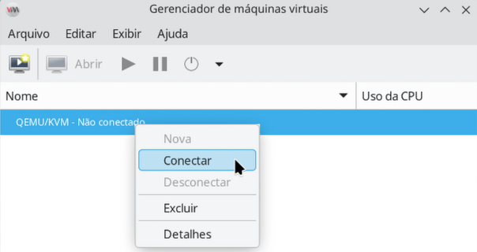

# Movendo QEMU+KVM pre-instalado para /home

Já tem o qemu+kvm instalado no seu sistema, né?  
Ao olhar, notou a existência da pasta:  
```
/var/lib/libvirt
```
Tudo bem, os procedimentos a seguir irão complementar ao que já foi instalado e também mover sua instalação para:

```
/home/libvirt
```
Há muitas vantagens para um desktop comum ter as máquinas virtuais em **/home** , onde geralmente foi formatado para ser uma partição em separado e durar para sempre e por isso, geralmente é a partição que terá bem mais espaço disponível, então vamos criar a pasta:

```bash
sudo mkdir -p /home/libvirt
```

## Pacotes principais do hypervisor

```bash
sudo apt install tree libvirt-daemon-system libvirt-clients \
  libguestfs-tools ovmf isc-dhcp-client dnsmasq-base swtpm swtpm-tools \
  qemu-system-modules-spice qemu-utils qemu-system-gui -y
```

O `apt` costuma instalar **dependências** (rede virtual, firmware UEFI, utilitários). A tabela resume o que cada nome costuma representar na prática:

| Pacote                                    | Explicação                                                                                                                                                                                                                                                                                                                                                                                                                                                 |
| ----------------------------------------- | ---------------------------------------------------------------------------------------------------------------------------------------------------------------------------------------------------------------------------------------------------------------------------------------------------------------------------------------------------------------------------------------------------------------------------------------------------------- |
| **qemu-kvm**                              | Emulação de CPU/dispositivos e aceleração **KVM** quando o hardware suporta (`/dev/kvm`). É o núcleo que de fato executa a VM.                                                                                                                                                                                                                                                                                                                             |
| **libvirt-daemon-system**                 | Serviço **libvirtd**: API estável para criar, iniciar e gerenciar domínios (VMs), redes e armazenamento.                                                                                                                                                                                                                                                                                                                                                   |
| **libvirt-clients**                       | Ferramentas de linha de comando (`virsh`, `virt-install`, entre outras) que falam com o libvirt.                                                                                                                                                                                                                                                                                                                                                           |
| **libguestfs-tools**                      | Utilitários **libguestfs** para trabalhar **em imagens de disco** sem necessariamente **ligar** a VM: inspecionar sistemas de arquivos (`virt-filesystems`, `virt-inspector`), copiar arquivos para dentro/fora da imagem (`virt-copy-in`, `virt-copy-out`), redimensionar disco (`virt-resize`), abrir **guestfish** para navegar partições e arquivos, preparar imagem para compactação (`virt-sparsify`), etc. Úteis para manutenção, backup e scripts. |
| **dnsmasq-base** *(dependência comum)*    | Base para **DNS/DHCP** leve; o libvirt usa isso na rede **NAT padrão** (`virbr0`) para dar IP às VMs.                                                                                                                                                                                                                                                                                                                                                      |
| **ovmf** *(dependência comum)*            | Firmware **EDK II/OVMF** para arranque **UEFI** em VM — quase obrigatório para **Windows** recente e muitos Linux em modo EFI.                                                                                                                                                                                                                                                                                                                             |
| **isc-dhcp-client** *(dependência comum)* | Cliente DHCP no hospedeiro; aparece na cadeia de dependências do ecossistema de rede.                                                                                                                                                                                                                                                                                                                                                                      |

## Permitir uso sem root

Para administrar VMs com o **usuário** normal (sem `sudo` constante), o **hospedeiro** precisa pertencer aos grupos **`kvm`** (acesso a `/dev/kvm`) e **`libvirt`** (API do libvirt). No Debian e Ubuntu o grupo **`kvm`** costuma existir; em outras famílias o nome ou o mecanismo pode diferir.

Confira se existe o grupo `kvm`:

```bash
getent group kvm
```

Verá algo como: 

> kvm:x:993  
ou  
> kvm:x:991:libvirt-qemu  

O comando acima indica quais usuários estão no grupo `kvm`, note que nosso usuário não está nele, então vamos incluí-lo:


```bash
sudo usermod -aG kvm $USER
sudo newgrp
```
Agora, vamos confirmar:
```bash
getent group kvm
```
O resultado agora incluirá o nosso usuário(ex gsantana):  
> kvm:x:993,**gsantana**    
ou  
> kvm:x:991:libvirt-qemu,**gsantana**  
  
Ao ver o seu login no fim da linha (por exemplo `gsantana`) significa que tudo deu certo. 
Em seguida aplique o mesmo raciocínio para **`libvirt`**:

```bash
getent group libvirt
```
Listará algo como:
> libvirt:x:975  
Se não apareceu seu usuário(ex `gsantana`), então precisará incluí-lo:
  
```bash
sudo usermod -aG libvirt $USER
sudo newgrp
```
Depois confira novamente:
```bash
getent group libvirt
```
Listará algo como:
> libvirt:x:975:gsantana  
Ao ver o seu login no fim da linha (por exemplo `gsantana`) significa que tudo deu certo. 

Sem acesso a estes grupos, o usuário não **acessa** os mesmos recursos que o daemon usa, e o **virt-manager** / **virsh** podem falhar ou pedir senha de administrador.

## Desktop: interface gráfica e integração com o convidado

O hypervisor funciona em forma de backend e serviço, ou seja, sua interatividade com o serviço de virtualização é apenas pelo terminal e para alguns de nós isso é uma 'sofrência' que dá dó. Mesmo em servidores usamos um sistema de gerenciamento com um frontend agradável como o **Proxmox**  para gerenciá-lo sem precisar requerer ao terminal.

Em estação de trabalho - como nosso caso - há outros como `gnome-boxes` e `Cockpit`, porém, o mais popular é o `virt-manager`, vamos instalá-lo:

```bash
sudo apt install virt-manager spice-client-gtk gir1.2-spiceclientgtk-3.0 -y
```

Com o `virt-manager` voce cria, altera e exclui suas VMs. Ele acompanha um viewer embutido, assim, ao criar por exemplo uma VM com o Windows, você poderá interagir com ele, como formatar e instalar o sistema. Mas existe outro viewer que é um pouco melhor, e na realidade, alguns serviços de interatividade só funcionam com ele, chama-se `virt-viewer`, vamos instalá-lo:

```bash
sudo apt install virt-viewer -y
```

### OBRIGATÓRIO: qemu-guest-agent

Canal **qemu-ga** para operações coordenadas (snapshot consistente, relógio, rede, etc.).  Instale:

```bash
sudo apt install qemu-guest-agent -y
```

### OBRIGATÓRIO: SPICE-VDAGENT

Ao criar uma VM, em algum momento você configurará a monitor como do tipo SPICE, daí voce poderá ter um clipboard integrado e redimensionamento automático da resolução da tela do convidado com o tamanho da janela.  Instale:

```bash
sudo apt install spice-vdagent -y
```

Depois de instalá-lo, confira se o serviço está habilitado:

```bash
sudo systemctl status spice-vdagentd
```

E caso esteja inoperante, você o inicia:

```bash
sudo systemctl start spice-vdagentd
```

Se o serviço não estiver ativo, tampouco o `spice-vdagentd` funcionará nas VMs.

### OPCIONAL: VIRTIOFSD

O pacote virtiofsd serve para compartilhar uma pasta do hospedeiro lINUX com a máquina virtual (Windows e Linux) usando virtio-fs. Em termos simples, ele é o daemon do lado do host que implementa esse compartilhamento para o QEMU/KVM. 

Não, ele não é obrigatório em toda instalação de QEMU/KVM.
Um detalhe importante: o virtiofsd é do lado do host, mas a VM também precisa de suporte ao virtio-fs para montar esse compartilhamento. Em alguns casos, recursos como migração/snapshot com memória podem ter restrições dependendo da versão do virtiofsd

No **hospedeiro**:

```bash
sudo apt install virtiofsd -y
```

Se vocÊ instalá-lo, lembre-se de que no Windows precisará também dos drivers `virtiofsd` para que ele possa enxergar as pastas que compartilhou com o host. Pessoalmente, no Windows, eu acho ele problemático com algumas aplicações. Como arquivos Linux são case sensitive, isso significa que podem existir arquivos de mesmo nome com maiusculas e minusculas diferente, e alguns aplicativos Windows se perdem com isso, por exemplo o **Rad  Studio Delphi e C++ Builder**.

### OPCIONAL: WEBDAV

Nas configurações da VM, você pode criar um canal  **WebDAV** via SPICE para transferir arquivos entre hospedeiro e convidado, é similar ao Virtio-FS, mas para fazer este compartilhamento usa-se o protocolo HTTP/HTTPS. Este tipo de compartilhamento é conhecido pelos programadores, ele é bem mais lento que o `Virtio-FS` e geralmente você só usaria ele com projetos de programação bem estruturados que funcione muito bem offline, mas que no final, precise sincronizar seus arquivos. Usá-lo como unidade de rede é praticamente inviável. Para tê-lo, instale:

```bash
sudo apt install spice-webdavd -y
```

Depois de instalá-lo, confira se o serviço está habilitado:

```bash
sudo systemctl status spice-vdagentd
sudo systemctl start spice-webdavd # caso esteja desativado
```

Ele também irá requerer o driver para convidado na máquina Windows.

## Ativar o libvirt no arranque

Com KVM e pacotes instalados, inicie o daemon e ative-o no boot:

```bash
sudo systemctl start libvirtd
sudo systemctl enable libvirtd
```

O `enable` pode mostrar linhas sobre *SysV* — é normal. Confirme:

```bash
sudo systemctl status libvirtd
```

E mostrará algo como:

```textile
● libvirtd.service - libvirt legacy monolithic daemon
     Loaded: loaded (/usr/lib/systemd/system/libvirtd.service; enabled; preset: enabled)
     Active: active (running) since Wed 2026-04-15 18:29:06 -03; 17s ago
 Invocation: 66bf2356ca0a4da78d45f1edb7ea6dda
TriggeredBy: ● libvirtd.socket
             ● libvirtd-ro.socket
             ● libvirtd-admin.socket
       Docs: man:libvirtd(8)
             https://libvirt.org/
   Main PID: 11927 (libvirtd)
      Tasks: 21 (limit: 32768)
     Memory: 6.1M (peak: 9.4M)
        CPU: 177ms
     CGroup: /system.slice/libvirtd.service
             └─11927 /usr/sbin/libvirtd --timeout 120

abr 15 18:29:06 ti-01 systemd[1]: Starting libvirtd.service - libvirt legacy monolithic daemon...
abr 15 18:29:06 ti-01 systemd[1]: Started libvirtd.service - libvirt legacy monolithic daemon.
```

Procure **`Active: active (running)`** e serviço **enabled**. Em versões recentes também pode haver *sockets* `libvirtd.socket`; o conjunto deve permitir `virsh list` sem erro de permissão (após grupos e nova sessão). Neste momento, é criado a pasta `/var/lib/libvirt` com toda a estrutura necessária para a virtualização.

### Primeira execução do virt-manager

Abra o **virt-manager**. Na árvore à esquerda, em **QEMU/KVM**, clique com o botão direito e escolha **Conectar**:  


Dê uma olhada na árvore sob **`/var/lib/libvirt`**. Vale inspecionar donos e grupos (útil antes de mudar o pool para outro disco):

```bash
sudo tree -ug --dirsfirst /var/lib/libvirt
```

Exemplo de saída:
```
[root     root    ]  /var/lib/libvirt  
├── [root     root    ]  boot  
├── [root     root    ]  dnsmasq  
│   ├── [root     root    ]  default.addnhosts  
│   ├── [root     root    ]  default.conf  
│   ├── [root     root    ]  default.hostsfile  
│   ├── [root     root    ]  virbr0.macs  
│   └── [root     root    ]  virbr0.status  
├── [libvirt-qemu libvirt-qemu]  images  
├── [libvirt-qemu libvirt-qemu]  qemu  
│   ├── [libvirt-qemu libvirt-qemu]  checkpoint  
│   ├── [libvirt-qemu libvirt-qemu]  dump  
│   ├── [libvirt-qemu libvirt-qemu]  nvram  
│   │   └── [libvirt-qemu libvirt-qemu]  win11-dx11_VARS.fd  
│   ├── [libvirt-qemu libvirt-qemu]  ram  
│   ├── [libvirt-qemu libvirt-qemu]  save  
│   └── [libvirt-qemu libvirt-qemu]  snapshot  
└── [root     root    ]  NAO_ME_APAGUE.txt  
```
Mais abaixo, se você mover o armazenamento para `/home`, será preciso **reproduzir donos e permissões**; esta árvore é a referência.

### Onde o pool `default` guarda discos por omissão

Depois da primeira ligação ao **QEMU/KVM**, o libvirt expõe o *pool* **`default`**, normalmente em **`/var/lib/libvirt/images`**.  Mas vamos confirmar, execute:

```bash
sudo virsh pool-list --all --details
```

A saída será similar a essa:

```
 Nome      Estado       Auto-iniciar   Persistente   Capacidade   Alocação    Diposnível
------------------------------------------------------------------------------------------
 default   executando   sim            sim           187,02 GiB   17,83 GiB   169,20 GiB
```

O pool `default` onde está sendo gravado? Vamos ver, execute:

```bash
sudo virsh pool-dumpxml default
```

Vai mostrar dentro de um texto longo algo como:

```textile
  <target>
    <path>/var/lib/libvirt/images</path>
  </target>
```

Isso indica exatamente onde nossas imagens serão criadas com o pool `default`. E como sabemos, estamos usando a partição /(root), NÃO FIZEMOS AINDA A MIGRAÇÃO PARA /HOME. E aí temos um problema, provavelmente a partição /(root) é um disco menor. Para solucionar este problema precisaremos usar um `bind mount`, mas precisaremos fazer isso com cuidado para não perder o que já instalamos.   

Antes de iniciar, vamos **Parar tudo**, isto é, desligue as VMs e pare o libvirt:

```bash
sudo systemctl stop libvirtd.service libvirtd.socket
```

Caso já tenha o /home/libvirt, vamos momentaneamnete renomeá-lo:
```bash
sudo mv /home/libvirt /home/libvirt.old
```

Agora vamos criar uma pasta vazia:  
```bash
sudo mkdir -p /home/libvirt
sudo chmod 775 /home/libvirt
```

Agora que já temos a pasta vazia `/home/libvirt`, podemos transferir para ela o conteúdo original de `/var/lib/libvirt`:
```bash
sudo rsync -aX /var/lib/libvirt/ /home/libvirt/
```
Aguarde a transferencia terminar.  
Quando concluir, por segurança, vamos renomear a antiga:  
```bash
sudo mv /var/lib/libvirt /var/lib/libvirt.bak
```

Se o comando acima falhar com  a mensagem:  

> mv: não foi possível mover '/var/lib/libvirt' para '/var/lib/libvirt.bak': Dispositivo ou recurso está ocupado

Então use o `fuse` para detectar quem ou o que está bloqueando a pasta:

```bash
fuser -v /var/lib/libvirt
```

E finalmente, depois de ter conseguido desbloquear, então repita o comando:

```bash
sudo mv /var/lib/libvirt /var/lib/libvirt.bak
```

Após ter mantido o backup desta pasta, vamos recriá-la, porém vazia:

```bash
sudo mkdir /var/lib/libvirt
sudo chmod 775 /var/lib/libvirt
```

**`/etc/fstab`** — adicione a linha do bind (ajuste o editor se preferir `nano`):  

```bash
sudo editor /etc/fstab
```
E cole o seguinte conteúdo:  
```
# bind: conteúdo real em /home/libvirt, visível em /var/lib/libvirt
/home/libvirt  /var/lib/libvirt  none  bind  0  0
```
Salve o arquivo e saia do editor.  
Porque usar `bind mount`? Porque programas como o **AppArmor** (ou equivalente) costuma **confiar** em bind mount ao caminho **canônico** esperado, teríamos problemas se usassemos  symlink aqui.

Guarde, recarregue unidades e monte:
```bash
sudo systemctl daemon-reload
sudo mount /var/lib/libvirt
```
Se tudo deu certo, vamos criar um arquivo especial em `NAO_ME_APAGUE.txt` na localização original, execute:
```bash
sudo editor /var/lib/libvirt/NAO_ME_APAGUE.txt
```
E cole o seguinte conteúdo:
```
Este é um ponto de montagem de/para:
/var/lib/libvirt para /home/libvirt
NÃO SÃO DUAS PASTAS DUPLICADAS, MAS ESPELHADAS
Se apagar daqui, estará apagando de lá.
```
Salve o arquivo e saia do editor de texto, e então faça a verificação dele na outra pasta:
```bash
ls -lh /home/libvirt/*.txt
```
Se listar algo como:    
> -rw-r--r-- 1 root root 116 Apr 28 17:52 /home/libvirt/NAO_ME_APAGUE.txt
O arquivo que criamos **NAO_ME_APAGUE.txt** servirá de atalho para que desatentos não achem que se trata de duplicidade de pastas.  
Depois de alguns dias, quando confirmar que tudo funciona, pode apagar **`/var/lib/libvirt.bak`**. 

Reinicie o libvirt:  
```bash
sudo systemctl start libvirtd.service libvirtd.socket
```

Agora que o `bind mount` já está funcionando, se executar algo como:
```bash
sudo virsh pool-list --all --details
```
Então listará algo como:
```
 Nome      Estado       Auto-iniciar   Persistente   Capacidade   Alocação     Diposnível
-------------------------------------------------------------------------------------------
 default   executando   sim            sim           937,82 GiB   269,10 GiB   668,72 GiB
```
Você vai notar que o pool `default` os campos **Capacidade** e **disponível** referem-se ao volume onde o *target* do pool está montado (em nosso caso `/home/libvirt/images`).

Se o estado do pool **`default`** não for **running** (ou **executando** ), inicie:
```bash
sudo virsh pool-start default
```

Se **autostart** (ou **autoiniciar**) não estiver ativo, habilite:  

```bash
sudo virsh pool-autostart default
```
## Movendo VMs para cá
Para reutilizar as VMs antigas neste novo servidor é simples, mas antes de copiar as VMs, faça o seguinte ajuste:
```bash
sudo chown -R libvirt-qemu:kvm /var/lib/libvirt/images
sudo chmod -R 775 /var/lib/libvirt/images
```
As permissões acima é o padrão a ser usada para a pasta que contêm as imagens de VMs, agora basta copiar as VMs que precisa - geralmente arquivos .qcow2 - para a nova pasta, exemplo:
```bash
sudo mv /home/libvirt.old/images/*.qcow2 /var/lib/libvirt/images
```
Mas ao copiar VMs para lá, os donos dos arquivos que forem para lá provavelmente serão o `root` porque você usou o `sudo` nestas cópias e daí vamos repetir as permissões:
```bash
sudo chown -R libvirt-qemu:kvm /var/lib/libvirt/images
sudo chmod -R 775 /var/lib/libvirt/images
```
Agora, podemos usar o gerenciador de virtualização e importar essas VMs.  

## Criando novos pools

O pool `default` para desktops é suficiente para o armazenamento de imagens de VMs. Mas caso queira criar novos pools para seprar VMs por grupo, exemplo, dekstops, servirores, isos, etc... o procedimento é o seguinte:

```bash
sudo virsh pool-define-as nome-do-pool dir --target /outro/lugar/images
sudo virsh pool-autostart nome-do-pool
sudo virsh pool-start nome-do-pool
```

Para uso só em desktop, um pool **`default`** bem dimensionado costuma bastar.

Ao **importar** uma imagem copiada de fora para o pool **`default`**, ajuste dono e modo para o QEMU conseguir abrir:
Define o padrão para o grupo kvm ter leitura e escrita (rw-):
```bash
sudo chown -R libvirt-qemu:kvm /outro/lugar/images
sudo chmod -R 775 /outro/lugar/images
```
(Ajuste o caminho se o *target* do pool for outro; após bind mount, `/var/lib/libvirt/images` e `/home/libvirt/images` apontam para o mesmo conteúdo.)

## Pool de ISOs

ISOs de instalação são grandes e pouco usadas depois da instalação; muita gente **as guarda** em disco **mais barato** (HDD) e deixa **SSDs** para imagens de VM — é sugestão, não regra.

Este exemplo usa **`/home/libvirt/isos`**:

```bash
sudo virsh pool-define-as isos dir - - - - "/home/libvirt/isos"
```

Ative e deixe no boot:

```bash
sudo virsh pool-build isos
sudo virsh pool-start isos
sudo virsh pool-autostart isos
```

Confira:

```bash
sudo virsh pool-list --all
```

Confirme o caminho XML:

```bash
sudo virsh pool-dumpxml "isos" | grep -oP '(?<=<path>).*(?=</path>)'
```

Para **redefinir** o pool (os arquivos na pasta **não** são apagados pelo libvirt):

```bash
virsh pool-list --all
sudo virsh pool-destroy isos
sudo virsh pool-undefine isos
```

Apague os `.iso` manualmente na pasta se quiser liberar espaço.  

## Pool em sistema de arquivos Btrfs

Se o *target* do pool estiver em **Btrfs**, vale ajustar *copy-on-write* e desempenho conforme o guia dedicado:

[Virtualização nativa QEMU/KVM com Btrfs](debian_qemu_kvm_btrfs.md)

## Rede

Até mesmos as redes, dentro do sistema de virtualização são representados por nome. Sempre haverá um `default`, note:

```bash
sudo virsh net-list --all
```

O resultado provavelmente será:

```
 Name      State      Autostart   Persistent
----------------------------------------------
 default   inactive   no          yes
```

No exemplo acima, o campo **State** (Estado) esta marcado como **inactive** (inativo), também o campo **Autostart**(auto-inicio). Nesta situação, esta rede `default` está inoperável. Para ligar:  

```bash
sudo virsh net-start default
sudo virsh net-autostart default
```

O resultado do comando acima, seria:

```
sudo virsh net-autostart default
Network default started

Network default marked as autostarted
```

Agora, repetimos o comando, e veja:

```bash
sudo virsh net-list --all
```

O resultado provavelmente será:

```
 Name      State      Autostart   Persistent
----------------------------------------------
default   active   yes         yes
```

Agora temos a rede `default` ligada.  
