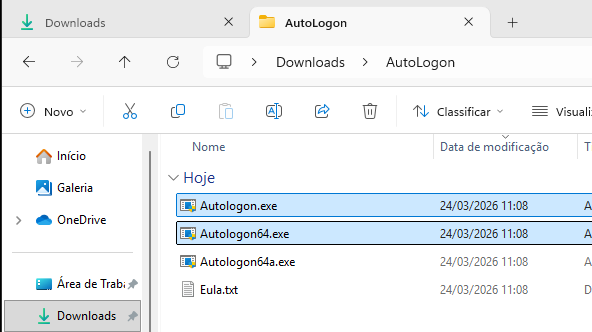
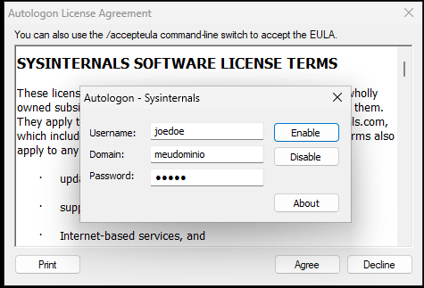
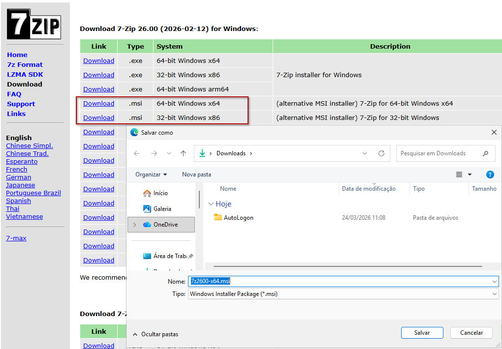
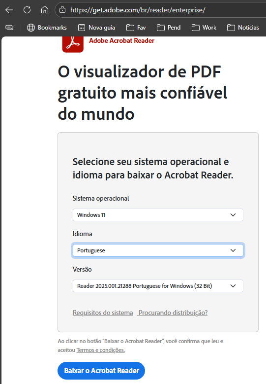
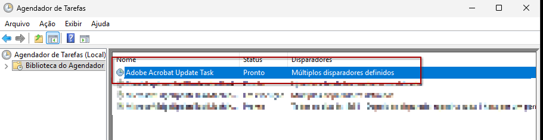
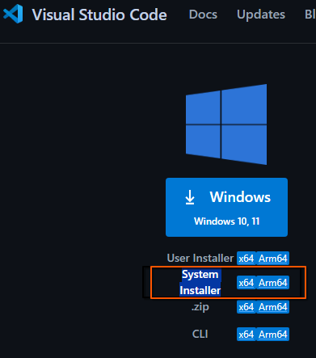
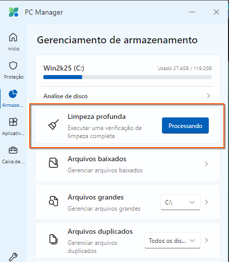
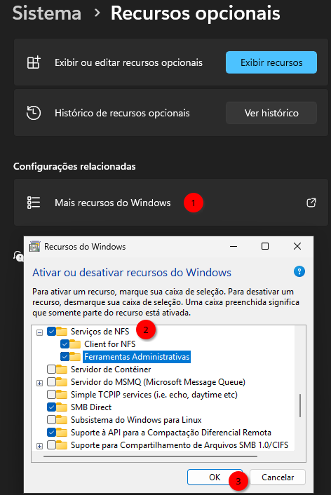
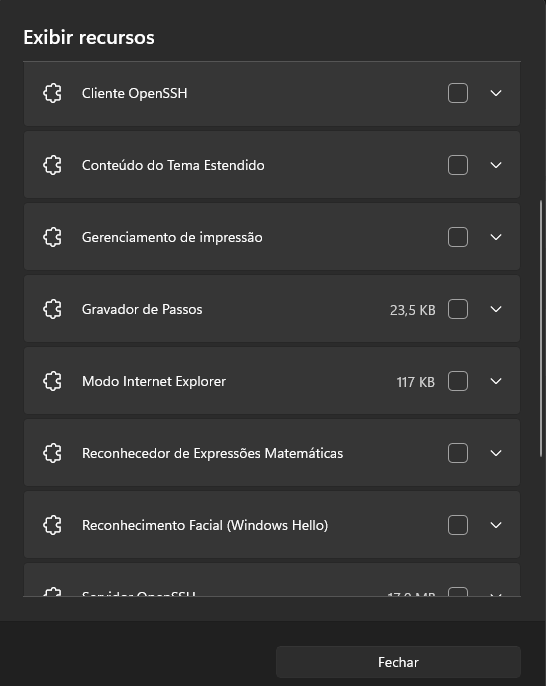
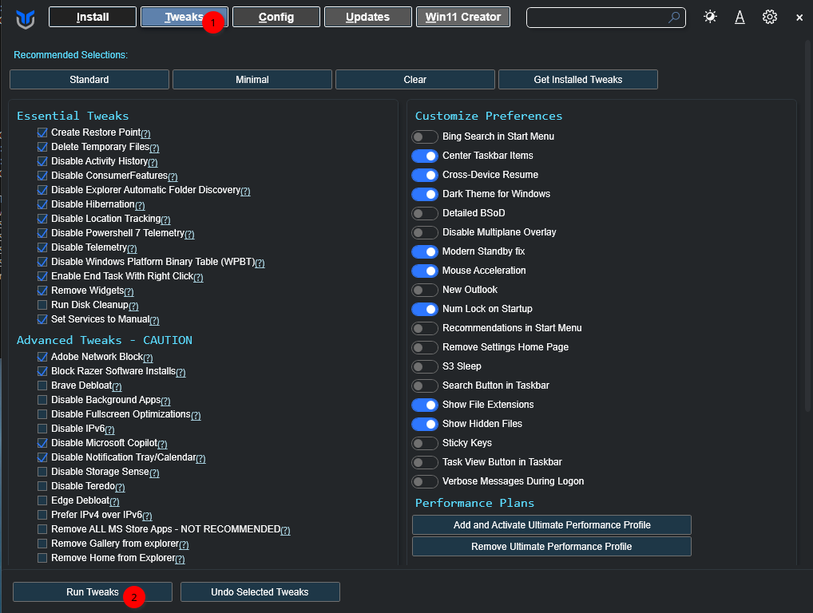

# WINDOWS BÁSICO

Um sistema Windows básico em minha opinião, não sobrevive sem estes programas:

---

## Autologon

**Autologon** é uma ferramenta utilitária Microsoft Sysinternals que automatiza o login no Windows, permitindo que uma máquina inicie e efetue autenticação sem intervenção manual. Funciona armazenando credenciais de forma cifrada no registro do Windows, ideal para cenários de servidor, VM de laboratório e automação de infraestrutura.  

Vale instalar em ambientes onde é necessário **boot desatendido** (unattended deployment), automação de testes em VMs de desenvolvimento, inicialização de serviços críticos que dependem de autenticação prévia, ou recuperação de ambientes após reinicializações não planejadas. Particularmente relevante em sua stack de **QEMU+KVM com Windows Server**, facilitando deployments ágeis, automação de laboratórios de teste, e gerenciamento centralizado de máquinas virtuais sem necessidade de interação via console gráfico.  

A ferramenta oferece interface CLI simples, criptografia segura das senhas no registro, e integração nativa com Group Policy, tornando-a solução prática para ambientes corporativos e de infraestrutura virtualizada. Durante o processo de criação da VM, já tínhamos sugerido sua instalação, mas caso ainda não tenha feito, é bastante recomendável.  

Download:  
[https://learn.microsoft.com/pt-br/sysinternals/downloads/autologon](https://learn.microsoft.com/pt-br/sysinternals/downloads/autologon)  

**Instalação:** você **precisa descompactar** o arquivo baixado (é um `.zip`). Dentro haverá, entre outros, **Autologon.exe** (32 bits) e **Autologon64.exe** (64 bits). Em **Windows de 64 bits** (o caso mais comum), copie **Autologon64.exe** para **`C:\Windows\System32`** — é o local usual para ferramentas de 64 bits e a pasta já está no `PATH`. O **Autologon.exe** de 32 bits, se for o que você usar num sistema 64 bits, deve ir para **`C:\Windows\SysWOW64`** (é onde o Windows coloca executáveis 32 bits; o nome da pasta parece “invertido”, mas é assim mesmo). Na prática você só precisa **de um** dos dois, conforme a arquitetura do Windows; não é necessário copiar os dois para dois lugares diferentes.



Execute **Autologon64.exe** (64 bits) ou **Autologon.exe** (32 bits) conforme a arquitetura do seu Windows. Na janela do utilitário, preencha as **credenciais** para o autologon (usuário, domínio se aplicável, senha), como na figura abaixo.



Confirme (por exemplo **Enable**). Na próxima inicialização, o Windows entrará automaticamente com essas credenciais.

---

## Win7z
7-Zip é um utilitário de compressão de código aberto que implementa o formato 7z, oferecendo taxa de compressão superior a ZIP e RAR através do algoritmo LZMA2. Compacta arquivos, reduzindo espaço em disco e banda de rede, enquanto suporta criptografia AES-256 e múltiplos formatos.  
Vale instalar por ser leve, versátil, disponível nos repositórios (ex: apt install p7zip-full) e essencial em workflows de backup e distribuição de artefatos—particularmente em cenários onde margem de espaço é crítica.  

Download:  
[http://www.7-zip.org/download.html](http://www.7-zip.org/download.html)  

Na página de download há pacotes **`.exe`** (instalador clássico) e **`.msi`** (Windows Installer). **Prefira o `.msi`**: integra-se ao serviço de instalação do Windows (registro em *Aplicativos e recursos* / *Aplicativos e funcionalidades*, reparação e desinstalação mais previsíveis, menos surpresas de “instalador empacotado”) e costuma ser a opção indicada em ambientes com políticas ou quando se quer um fluxo de instalação alinhado ao padrão Microsoft. O `.exe` continua válido, mas o `.msi` é em geral mais limpo para administração do sistema.



A **instalação** é bastante simples: execute o arquivo baixado, aceite a licença se solicitado, confirme o caminho (o padrão costuma servir) e conclua com **Instalar** / **Install**.

**Definir o 7-Zip como aplicativo padrão** para arquivos compactados (opcional, mas útil):

- **Pelo próprio 7-Zip:** abra o **7-Zip File Manager** (`7zFM.exe`) → menu **Ferramentas** → **Opções** (em inglês: **Tools** → **Options**) → separador **Sistema** / **System** (ou **7-Zip** nas versões recentes) → marque as extensões que deseja associar (por exemplo `.zip`, `.7z`, `.rar`, `.tar`, `.gz`) → **Aplicar** / **Apply** → **OK**. Isso grava as associações no perfil do usuário.
- **Pelas configurações do Windows:** **Configurações** → **Aplicativos** → **Aplicativos padrão** → **Escolher padrões por tipo de arquivo** (no Windows 11 o caminho pode ser o mesmo ou **Aplicativos padrão** → **Escolher padrões por tipo de arquivo**) → localize extensões como `.zip` ou `.7z` e selecione **7-Zip**.

Assim, ao dar duplo clique em um arquivo, o Windows abre no 7-Zip em vez do Explorador ou de outro descompactador.

---

## Adobe Reader
**Adobe Reader** é o aplicativo oficial da Adobe para visualização de documentos **PDF** (Portable Document Format). Oferece leitura confiável com preservação de formatação, fontes e layouts complexos, além de funcionalidades como anotações, preenchimento de formulários interativos e assinatura digital.  
Vale instalar por garantir **compatibilidade total com PDFs proprietários**, especialmente ao lidar com **formulários interativos e campos dinâmicos**—onde é praticamente indispensável. Embora não seja o mais rápido para abrir PDFs simples (existem alternativas mais ágeis como Okular ou Evince), é o **mais compatível** quando o documento exige fidelidade total a recursos avançados e funcionalidades proprietárias.  

Download:  
[http://get.adobe.com/br/reader/enterprise/](http://get.adobe.com/br/reader/enterprise/)  

**Observação:** até o momento **não há** distribuição oficial do **Adobe Acrobat Reader** em executável **somente 64 bits** para Windows — o produto continua, na prática, no modelo **32 bits** (pastas como `Program Files (x86)`), mesmo em sistemas operacionais de 64 bits. Confira no site da Adobe se isso mudou depois da publicação deste guia.

**ALERTA (instalador):** o link acima é para baixar a versão offline; não use o instalador online (websetup), pois ele pode instalar junto outros programas que você não pediu. A versão online é uma das mais traiçoeiras: pode incluir software adicional que a Adobe empacotar no fluxo. Use sua conta e o pacote offline corporativo quando possível.

**ALERTA (privacidade e sistema limpo):** os softwares da Adobe **não são** a melhor escolha para quem prioriza **privacidade** e um **sistema enxuto**. Depois de instalado, o Reader costuma **manter comunicação de rede** com servidores da Adobe; não há transparência total sobre **o que envia** ou quando. Além disso, costuma ser criada uma **tarefa no Agendador de tarefas** para, em períodos de **ociosidade**, verificar atualizações. Em algumas versões a Adobe também inclui **programas ou serviços** que passam a carregar com o Windows.

Se mesmo assim você precisar do Reader, vale **endurecer** o ambiente. **Não** incluímos aqui passos de firewall bloqueando um `.exe` específico: o tráfego pode vir de **outros** processos ou serviços da Adobe (atualizadores, helpers, etc.), e não há como garantir que bloquear só o executável principal cubra tudo.




1. **Agendador de tarefas (remover ou desativar atualização automática)**  
   - Abra o **Agendador de tarefas** (`r` ou pesquise pelo nome).  
   - No painel esquerdo, em **Biblioteca do Agendador de tarefas**, expanda e procure pastas ou tarefas com **Adobe** no nome.  
   - Clique com o botão direito nas tarefas relacionadas a **atualização**, **Adobe Acrobat Update** ou similares → **Desabilitar** (mais seguro que apagar, se quiser reverter) ou **Excluir**, se tiver certeza.  
      

2. **Programas na inicialização do Windows**  
   - Pressione **Ctrl+Shift+Esc** para abrir o **Gerenciador de Tarefas** → aba **Inicialização** (no Windows 11: **Mais detalhes** primeiro, se aparecer compacto).  
   - Ou: **Configurações** → **Aplicativos** → **Inicialização**.  
   - Desative itens **Adobe** (Reader, updater, etc.) que não forem necessários.  
   - Opcional: em **Gerenciador de Tarefas** → **Inicialização**, verifique o impacto na inicialização e desative o que for “Alto” e não essencial.


3. **Conferência após instalar**  
   - Repita os passos acima **depois de cada atualização** do Reader, pois instaladores às vezes recriam tarefas e entradas de inicialização.

---

## Visual Studio Code
**Visual Studio Code** (VS Code) é um **editor de código-fonte leve e extensível** desenvolvido pela Microsoft, baseado em Electron. Oferece suporte nativo a múltiplas linguagens de programação, debugging integrado, controle Git embutido e um ecossistema massivo de extensões que adaptam a ferramenta a qualquer workflow técnico.  
Vale instalar por ser **gratuito, multiplataforma** (Windows, Linux, macOS) e extremamente performático mesmo em máquinas com recursos limitados. Sua curva de aprendizado reduzida, comunidade ativa e integração com ferramentas DevOps (Docker, Kubernetes, SSH remoto) o tornaram **padrão na prática** entre desenvolvedores e administradores de sistemas. É ideal para codificação em PHP, JavaScript, Python, C/C++ e scripting—essencial em ambientes de infraestrutura e desenvolvimento.  

Hoje o VS Code **já não é unanimidade** para quem quer **IA nativa e forte** no fluxo de edição (completar, refatorar, explicar o repositório inteiro). Se quiser **opcionalmente** experimentar outras bases no lugar dele ou em paralelo, duas opções em destaque são **Cursor** e **Google Antigravity** (em conversas informais o nome costuma aparecer abreviado como **Antigravity** ou até **“Gravity”** — o produto oficial é o [Google Antigravity](https://antigravity.google/download)):

**Cursor** — editor derivado do ecossistema VS Code, pensado para **IA em primeiro plano**: chat com contexto do projeto, edições em vários arquivos de uma vez, integração com modelos para gerar e ajustar código sem ficar só no autocompletar linha a linha. Para muitos times, isso é mais **conveniente** do que montar manualmente extensões de IA no VS Code tradicional.  
Download: [https://cursor.com/downloads](https://cursor.com/downloads)

**Google Antigravity** — plataforma **centrada em agentes**: além da visão de editor com IA, há uma área para **orquestrar agentes** que planejam e executam tarefas através de **editor, terminal e navegador**; os agentes podem entregar **artefatos** (planos, capturas, registros) para você revisar em vez de só despejar log bruto. Há suporte a **vários modelos** (por exemplo Gemini e outros, conforme a versão e política da Google).  
Download: [https://antigravity.google/download](https://antigravity.google/download)

Nada impede manter **VS Code** instalado e usar um desses editores só em projetos onde a IA agregue mais — são escolhas **opcionais**, não obrigatórias.

Durante a instalação, não esqueça de marcar as opções:  
* Adicione a ação "Abrir com o Code" ao menu de contexto de arquivos do Windows Explorer.
* Adicione a ação "Abrir com o Code" ao menu de contexto de pastas do Windows Explorer.

Download:  
[https://code.visualstudio.com/](https://code.visualstudio.com/)    

**ALERTA**: muito cuidado com o download — a maioria das pessoas vai intuitivamente na primeira opção, **User Installer**, que se instala só no perfil do usuário. É melhor baixar a versão **System Installer**, que fica disponível para todos os perfis da máquina:  
   

---

## Notepad++

**Notepad++** é um editor de texto leve baseado em Scintilla, com suporte a syntax highlighting para múltiplas linguagens, busca avançada e manipulação de arquivos em lote. Funciona como substituto aprimorado do Notepad padrão do Windows com recursos de produtividade básicos.  
Vale instalar apesar de ser **inferior ao VS Code em praticamente todos os aspectos** (extensibilidade, debugging, integração DevOps, comunidade). Porém, para **abrir arquivos simples** como .txt, .ini, .log e configurações de baixa complexidade, o Notepad++ é **significativamente mais rápido**—inicialização quase instantânea versus overhead do VS Code. Recomenda-se mantê-lo instalado em cenários onde velocidade de abertura de arquivos textuais é prioridade, complementando (não substituindo) o VS Code no arsenal técnico.  

Download:  
[https://notepad-plus-plus.org/downloads/](https://notepad-plus-plus.org/downloads/)   

Ao instalar o programa, escolha o idioma em português logo no início do assistente.  
Depois de instalá-lo, em tipos de arquivo como `.txt` e `.ini`, use **Propriedades** → **Alterar** (ou **Abrir com**) e defina o Notepad++.   

---

## LinkShell Extension

**LinkShell Extension** é uma extensão de contexto do Windows Explorer que facilita a criação de **hard links, symbolic links (junctions) e copy-on-write** diretamente via menu de clique direito. Oferece interface gráfica intuitiva para operações de linking que normalmente exigiriam comandos de linha de comando complexos.  
Vale instalar por permitir **gerenciamento eficiente de espaço em disco** através de hard links (múltiplas referências ao mesmo arquivo físico), essencial em cenários de backup deduplicated, repositórios de desenvolvimento e arquivamento. É particularmente útil para administradores que trabalham com armazenamento otimizado ou ambientes onde a economia de espaço é crítica—oferecendo alternativa visual robusta à manipulação manual via CMD ou PowerShell.  
Depois da instalação, recomenda-se encerrar a sessão e entrar de novo no Windows (ou reiniciar).  

Download:  
[http://schinagl.priv.at/nt/hardlinkshellext/linkshellextension.html](http://schinagl.priv.at/nt/hardlinkshellext/linkshellextension.html)   

Serão dois downloads, o runtime [vc_redist.x64.exe](https://aka.ms/vs/15/release/vc_redist.x64.exe) e o programa principal.  
Ao instalar o programa principal, escolha o idioma em português no início do assistente.  

---

## VLC Media Player
**VLC Media Player** é um reprodutor multimídia de código aberto que suporta uma ampla variedade de formatos de vídeo, áudio e streaming (MPEG, H.264, HEVC, MP3, FLAC, OGG, entre outros). Funciona como solução completa para reprodução, conversão e manipulação de mídia sem dependência de codecs externos.  
Vale instalar por ser **multiplataforma** (Windows, Linux, macOS), leve, sem publicidade intrusiva e praticamente **compatível com qualquer formato multimídia**—eliminando a necessidade de múltiplos players especializados. Oferece funcionalidades avançadas como streaming de rede, captura de tela, conversão de formatos e suporte a legendas, tornando-o essencial em ambientes onde flexibilidade e compatibilidade de mídia são requisitos operacionais.  

Download:  
[https://www.videolan.org/vlc/](https://www.videolan.org/vlc/)   

Ao instalar o programa, escolha o idioma em português no início do assistente.  

---

## RAMMap
**RAMMap** é uma ferramenta de diagnóstico desenvolvida pela Microsoft (Sysinternals) que oferece **visualização detalhada e em tempo real da alocação de memória RAM** no Windows. Mapeia como a memória física é distribuída entre processos, cache, kernel e outros componentes do sistema operacional.  
Vale instalar por ser **essencial para troubleshooting de performance** e identificação de vazamentos de memória, processos consumidores excessivos e comportamento anômalo de cache. Para **gestores de TI e administradores de sistemas**, o RAMMap é uma ferramenta indispensável em análise de gargalos, planejamento de capacidade e diagnóstico de instabilidades—oferecendo granularidade que Task Manager não fornece. Permite decisões baseadas em dados concretos sobre alocação de recursos e identificação de problemas antes de impactarem produção.  

Download:  
[https://learn.microsoft.com/en-us/sysinternals/downloads/rammap](https://learn.microsoft.com/en-us/sysinternals/downloads/rammap)

A “instalação” não é óbvia: vem um `.zip` com três executáveis:
* **RAMMap.exe** — copie para **`C:\Windows\SysWOW64`** só se for depurar um **aplicativo de 32 bits**; na maioria dos casos você não usará.  
* **RAMMap64.exe** — copie para **`C:\Windows\System32`**; é o que você vai usar no dia a dia em Windows de 64 bits.  
* **RAMMap64a.exe** — para hardware que não seja Intel/AMD típico; ignore na dúvida.

Consideramos aqui um **Windows de 64 bits**.  
Para abrir, pressione **Win+R**, digite **`RAMMap64`** e confirme.  

---

## PuTTY
**PuTTY** é um cliente SSH/Telnet leve e multiplataforma que oferece acesso seguro a servidores remotos via protocolo SSH, além de suporte legado a Telnet, Rlogin e serial connections. Funciona como ferramenta essencial para administração remota de infraestrutura Unix/Linux e dispositivos de rede.  

Vale instalar por ser **gratuito, portável e extremamente leve**, sem dependências complexas—ideal para acesso rápido a servidores Debian, RedHat e outras distribuições Linux. Oferece autenticação por chave pública/privada, port forwarding local/remoto, suporte a SOCKS proxy e gerenciamento de sessões salvas, tornando-o **padrão na prática** para administradores em ambientes Windows que precisam administrar infraestrutura Linux/Unix. Embora existam alternativas mais novas, como o Windows Terminal com OpenSSH integrado, o PuTTY segue útil pela compatibilidade e pelo consumo baixo de recursos.  

Download:  
[https://www.chiark.greenend.org.uk/~sgtatham/putty/latest.html](https://www.chiark.greenend.org.uk/~sgtatham/putty/latest.html)

---

## FileZilla

**FileZilla** é um cliente FTP/SFTP/FTPS multiplataforma de código aberto que oferece transferência segura de arquivos para servidores remotos. Funciona como solução completa para gerenciamento de deployments, backup e sincronização de arquivos em infraestrutura distribuída.  

Vale instalar por ser **gratuito, intuitivo e suportar múltiplos protocolos** (FTP, SFTP com chaves SSH, FTPS com TLS/SSL), essencial para administradores que precisam transferir arquivos entre ambientes Windows e servidores Linux/Unix. Oferece gerenciamento de sites salvos, sincronização bidirecional, fila de transferências paralelas e suporte a proxy, tornando-o ferramenta indispensável em cenários de manutenção de servidores, deployment de aplicações e gerenciamento de conteúdo. Particularmente útil em workflows que não justificam overhead de ferramentas mais complexas como rsync ou git.  

**ADVERTÊNCIA:** no site do FileZilla costuma haver aviso de que o **instalador pode incluir software promocional**. Por isso o link abaixo aponta para a página com **todas as opções de download**; prefira o pacote **sem** ofertas, se disponível. Mesmo assim, durante a instalação, desmarque qualquer caixa de programa extra que não queira.  

Download: 
[https://filezilla-project.org/download.php?show_all=1](https://filezilla-project.org/download.php?show_all=1)   

---

## Git para Windows
**Git** é um **sistema de controle de versão distribuído** que rastreia alterações em arquivos e projetos, permitindo histórico completo de modificações, ramificações paralelas (branches) e colaboração entre múltiplos desenvolvedores. Cada repositório Git funciona como uma cópia independente e auditável do projeto.  

Vale instalar por ser o **padrão da indústria** em versionamento de código, integrar-se com plataformas como GitHub e GitLab, facilitar **reversão de mudanças** e **merge de branches**, além de ser essencial em pipelines CI/CD modernos. É indispensável para qualquer desenvolvedor ou administrador que trabalhe com infraestrutura como código (IaC).  
O instalador sugere instalar em **C:\Program Files\Git**, no entanto, para configurar outras ferramentas de programação e ajustar o PATH nestas ferramentas, eu sugiro instalar em **C:\Git** e não criar atalho no menu Iniciar nem na área de trabalho.  

Durante a instalação do git, ele faz uma pergunta sobre qual editor de texto usar em casos especiais, por exemplo para `commit`, `diff` entre outras, as opções geralmente são: **vim**, **notepad++**, **VS Code** ou até o Bloco de notas do Windows; se não souber qual usar, escolha **Notepad++**. Na mesma instalação, o Git pergunta o **terminador de linha**: na Web, Linux e macOS costuma ser só LF; no Windows, CRLF. Se você trabalha com os dois mundos (como é comum), responda **Checkout as-is, commit as-is** para o Git não converter linha à toa. Muita gente já estragou projeto de time por escolher errado aqui.

Download:  
[https://git-scm.com/downloads/win](https://git-scm.com/downloads/win)  

---

## Windows Update
Aproveite este momento para fazer todas as atualizações do Windows, faça-o até não haver mais nenhuma.  


---

## PC Manager para Windows
**PC Manager** é um **utilitário de otimização e limpeza de sistema** que oferece gerenciamento centralizado de recursos, monitoramento de desempenho, limpeza de arquivos temporários e malware, além de controle de inicialização e processos em background. Funciona como um painel unificado para manutenção preventiva do Windows, consolidando funcionalidades espalhadas entre ferramentas nativas do sistema operacional.

Vale instalar por ser uma **ferramenta oficial da Microsoft** com integração nativa ao Windows 11 e Windows Server, otimizar o desempenho da máquina removendo bloatwares e processos desnecessários, facilitar o **monitoramento em tempo real** de CPU, memória e disco, oferecer limpeza de startup para acelerar boot, além de incluir proteção contra malware e PUPs (Potentially Unwanted Programs). É especialmente relevante para administradores de TI que gerenciam múltiplas estações e precisam manter a integridade e desempenho da frota de máquinas.

Durante a instalação do PC Manager, ele se integra automaticamente à Configurações do Windows e cria atalhos no menu Iniciar. Diferentemente de ferramentas legacy, a Microsoft o mantém atualizado via Microsoft Store, garantindo que você sempre tenha a versão mais recente com correções de segurança. Recomenda-se **fixar o aplicativo na barra de tarefas** para acesso rápido durante rotinas de manutenção, especialmente em cenários de troubleshooting de performance.

Ao executar pela primeira vez, o PC Manager oferece uma **varredura completa do sistema** recomendando ações prioritárias. Preste atenção às categorias: **Limpeza** (arquivos temporários, cache, downloads antigos), **Startup** (processos de inicialização desnecessários), **Apps** (desinstalação de software redundante) e **Segurança** (verificação de malware e PUPs). Para ambientes corporativos ou máquinas críticas, execute um **diagnóstico prévio** antes de aplicar limpezas agressivas, documentando o estado inicial para auditoria.

Uma prática recomendada é executar o PC Manager **mensalmente em estações de trabalho** e **semanalmente em servidores de desenvolvimento**, configurando as exclusões apropriadas para não remover arquivos críticos de aplicações específicas (como dados de bancos de dados, arquivos de projeto ou configurações de ferramentas de CI/CD). Se você gerencia múltiplas máquinas, integre o PC Manager em scripts de manutenção preventiva via PowerShell ou Task Scheduler, aproveitando sua CLI para automação.

Download:  
[https://apps.microsoft.com/detail/9pm860492szd?hl=pt-BR&gl=BR](https://apps.microsoft.com/detail/9pm860492szd?hl=pt-BR&gl=BR)

Aproveite este momento para fazer uma **Limpeza profunda** usando o PC Manager:  

  

---

## Instalando recursos opcionais do Windows

Em **Configurações** → **Aplicativos** → **Recursos opcionais** → **Mais recursos do Windows** (ou execute **`optionalfeatures`** no menu Executar), marque para instalação, entre outros que precisar:



- **Cliente para NFS** (ou **Serviços para NFS** com o componente de cliente — o nome exato depende da edição do Windows; em algumas builds aparece agrupado em *Serviços para NFS*).
- **Cliente Telnet** (*Telnet Client*).
- **Cliente OpenSSH** (*OpenSSH Client*) — ferramentas de linha de comando `ssh`, `scp`, `sftp` para acessar servidores Linux/host sem instalar software de terceiros.
- **Servidor OpenSSH** (*OpenSSH Server*) — permite que a própria VM Windows aceite **sessões SSH** (útil para automação, cópia de arquivos e acesso remoto a partir do Linux hospedeiro ou de outras máquinas na rede).

Se **alguma dessas opções não aparecer** na lista para marcar, é bem provável que **já tenha sido instalada** antes (atualização do Windows ou imagem corporativa). Nesse caso, em **Configurações** → **Aplicativos** → **Recursos opcionais**, use **Exibir recursos** (ou **Recursos instalados** / lista do que já está no sistema — o rótulo varia um pouco) para **conferir o que já está instalado** e não duplicar.



**Por que isso ajuda quem desenvolve e usa uma VM**

- **NFS:** em laboratórios com **Linux no host** ou **storage NFS** (NAS, servidor de arquivos), o cliente NFS permite **montar pastas de rede no estilo Unix** sem depender só de SMB. Isso agiliza testes de aplicações, cópia de artefatos e integração com pipelines que já expõem NFS — cenário comum quando a VM Windows precisa consumir o mesmo export que serviços Linux usam.
- **Telnet:** o cliente **não** é para “login seguro” (Telnet é inseguro por natureza), mas é útil para **testar se uma porta TCP está aberta** e para **diagnóstico rápido** de serviços legados em homologação. Em VM de desenvolvimento, isso evita instalar ferramentas extras só para um teste pontual.
- **OpenSSH (cliente):** integra-se ao fluxo típico de **Git por SSH**, **deploy** e **administração em servidores Linux** a partir do Windows.
- **OpenSSH (servidor):** em VM, permite **entrar por SSH** no Windows (com autenticação e firewall bem configurados) para scripts e cópias, **sem depender só de RDP** — prático quando o host é Linux.

**Observação:** alguns recursos (NFS em profundidade) podem não existir em todas as edições (**Home** vs **Pro**/**Enterprise**). Se a opção não aparecer na lista de novos recursos, confira também **Exibir recursos** e a edição do Windows; use alternativas (SMB, virtio-fs, etc.) quando necessário.

**Via PowerShell (como administrador)** — ajuste se o nome do recurso for recusado pelo sistema:

```powershell
dism /online /enable-feature /featurename:TelnetClient
# Cliente NFS (quando disponível na edição):
dism /online /enable-feature /featurename:ServicesForNFS-ClientOnly
# OpenSSH (capacidades; o sufixo 0.0.1.0 pode variar — use Get-WindowsCapability para confirmar):
Add-WindowsCapability -Online -Name OpenSSH.Client~~~~0.0.1.0
Add-WindowsCapability -Online -Name OpenSSH.Server~~~~0.0.1.0
```

Reinicie se o assistente pedir.

---

## Instalando o RSAT (opcional)

As **Ferramentas de Administração de Servidor Remoto** (*Remote Server Administration Tools*, **RSAT**) são o conjunto de consoles da Microsoft para administrar **Active Directory**, **DNS**, **DHCP**, **Política de Grupo**, **certificados**, etc., **a partir de um Windows cliente** — sem precisar abrir sessão no servidor com área de trabalho.

**Quando vale a pena:** se você **lida com redes em domínio Microsoft** (AD DS), precisa **criar usuários**, **resetar senha**, **verificar GPO**, **consultar DNS interno** ou **DHCP** enquanto usa uma **VM Windows** de trabalho, instalar o RSAT nessa VM evita depender de outra máquina só para abrir `dsa.msc`, `gpmc.msc`, `dnsmgmt.msc` e similares.

**Como instalar (Windows 10 / 11 — build recente)**

1. Abra **Configurações** → **Aplicativos** → **Recursos opcionais** (ou **Recursos avançados opcionais**, conforme a versão).
2. Em **Adicionar um recurso** / **Exibir recursos**, use a pesquisa por **RSAT** ou pelo componente desejado (ex.: **RSAT: Ferramentas de Active Directory Domain Services e Lightweight Directory Services**, **RSAT: Gerenciamento de Política de Grupo**, **RSAT: Ferramentas de DNS**, etc.).
3. Instale só o que for usar — cada módulo ocupa espaço e aparece no menu Ferramentas administrativas do Windows.

**Alternativa (PowerShell como administrador)** — listar o que está disponível e instalar um pacote (exemplo; o nome exato varia com a build):

```powershell
Get-WindowsCapability -Online | Where-Object Name -like 'Rsat*'
# Exemplo (confira o Name exato na saída acima):
Add-WindowsCapability -Online -Name "Rsat.ActiveDirectory.DS-LDS.Tools~~~~0.0.1.0"
```

Em **edições Home** do Windows, o RSAT costuma **não** estar disponível; aí a solução é usar uma edição **Pro/Enterprise** na VM ou administrar o domínio a partir de outra estação onde o RSAT esteja instalado.

---

## Winutil (Chris Titus Tech) — script opcional

O projeto **[Winutil](https://github.com/ChrisTitusTech/winutil)** (Chris Titus Tech) é um utilitário em **PowerShell** que reúne **instalação de programas**, **ajustes (“tweaks”)**, **configurações** e ajuda com **atualizações** do Windows numa interface única. A documentação oficial e o código-fonte estão no repositório; o lançamento recomendado usa um script obtido por HTTPS (veja abaixo).

### Vantagens
- **Um só lugar** para instalar pacotes comuns, aplicar otimizações e correções sem abrir dezenas de sites.
- **Código aberto** (licença MIT no repositório), com histórico público e comunidade grande — você pode inspecionar o que executa antes de confiar.
- **Fluxo padronizado** para quem monta várias máquinas (laboratório, VM, desktop de uso pessoal).

### Riscos (leia antes de executar)
- O script roda com **privilégios de administrador** e pode **alterar o sistema** (serviços, políticas, pacotes). Erro de uso ou combinação ruim de opções pode deixar o Windows instável.
- Você está **confiando no autor e na cadeia de entrega** (o comando baixa e executa código da internet). Sempre há risco teórico de **supply chain** (site ou DNS comprometido). Em ambientes **corporativos ou com dados sensíveis**, alinhe com a TI antes.
- **“Tweaks” agressivos** podem conflitar com políticas da empresa, antivírus ou drivers — teste primeiro em **VM** ou backup.

Se, **após** ponderar prós e contras, você **aceitar** esse nível de confiança, siga os passos abaixo. Se não aceitar, **não execute** o comando.

### Execução (Windows — PowerShell como administrador)

1. Abra o **PowerShell** ou o **Terminal do Windows** **como administrador** (botão direito no menu Iniciar → *Terminal (Administrador)* ou *Windows PowerShell (Administrador)*).
2. O projeto documenta o comando estável (branch recomendada):

```powershell
irm "https://christitus.com/win" | iex
```

Isso usa `Invoke-RestMethod` (`irm`) para baixar o script e `Invoke-Expression` (`iex`) para executar. A janela do Winutil deve abrir.

3. Se aparecer erro de **política de execução**, na **mesma** janela elevada, tente antes só nesta sessão:

```powershell
Set-ExecutionPolicy -Scope Process -ExecutionPolicy Bypass
irm "https://christitus.com/win" | iex
```
**Rede com proxy (para o script conseguir baixar e rodar)**

O `irm` precisa de **HTTPS** até `christitus.com` (e, dependendo da versão, outros hosts que o próprio script chamar). Com **proxy autenticado**, use o endereço do servidor, a porta e as credenciais diretamente no comando:

```powershell
$proxy = "http://ip.do.servidor.proxy:porta"
$sec   = ConvertTo-SecureString "senhadousuario" -AsPlainText -Force
$cred  = New-Object System.Management.Automation.PSCredential("logindousuario", $sec)

irm "https://christitus.com/win" -Proxy $proxy -ProxyCredential $cred | iex
```

Substitua `ip.do.servidor.proxy`, `porta`, `logindousuario` e `senhadousuario` pelos dados da sua rede.

Os parâmetros `-Proxy` e `-ProxyCredential` em `irm` existem no **PowerShell 7** e em versões recentes. Se o **Windows PowerShell 5.1** reclamar que não conhece `-Proxy`, execute o mesmo bloco no **PowerShell 7** (`pwsh`), [instalável à parte](https://aka.ms/powershell).

Se o proxy **não** exigir usuário/senha (apenas endereço:porta), teste só com `-Proxy` (sem `-ProxyCredential`) ou configure o proxy nas **Opções da Internet** (**Win+R** → `inetcpl.cpl` → **Conexões** → **Configurações da LAN**) e execute o `irm` normalmente.

Peça à **TI** liberação de saída **HTTPS (443)** para **`christitus.com`**; se houver **inspeção SSL** no proxy, o certificado raiz da empresa precisa ser confiável no Windows. Se o **SmartScreen** ou o **antivírus** bloquear o download, siga a política local da organização.

Mais detalhes, *issues* conhecidos e alternativas de instalação: [repositório winutil no GitHub](https://github.com/ChrisTitusTech/winutil).


### Primeira execução — Tweaks (sugestão)

Na primeira vez que o script **Winutil** estiver aberto, vá em **Tweaks**, clique no botão **Standard** e ele marcará automaticamente várias opções. A partir daí, recomendo o seguinte:

| Opção (seção) | Ação sugerida |
|:--|:--|
| **Run Disk Cleanup** (lista após **Standard**) | **Desmarcar** — essa etapa costuma **demorar muito**; faça a limpeza de disco manualmente no final, **fora** do Winutil. |
| **Disable Hibernation** | **Marcar** |
| **Remove Widgets** | **Marcar** |
| **Adobe Network Block** (*Advanced Tweaks*) | **Marcar** |
| **Block Razer Software Installs** (*Advanced Tweaks*) | **Marcar** (o nome na interface pode variar, ex.: **VBlock Razer Software Installs**, conforme a versão do Winutil). |
| **Disable Microsoft Copilot** (*Advanced Tweaks*) | **Marcar** |

Em **Customize preferences**, costumo deixar assim (ajuste se os rótulos mudarem de nome na sua versão):

| Preferência | Valor sugerido |
|:--|:--|
| Bing Search in Start Menu | Desligado |
| Num Lock on Startup | Ligado |
| Recommendation in Start Menu (ou “Recomendation”, conforme o rótulo) | Desligado |
| Show Extensions | Ligado |
| Show Hidden Files | Ligado |
| Task View Button in TaskBar | Desligado |

Por fim, clique em **Run Tweaks** e aguarde a conclusão.



**Plano Ultimate Performance (opcional):** caso **queira maximizar o desempenho**, no Winutil clique também em **Add and Activate Ultimate Performance Profile** (o rótulo pode variar um pouco, mas costuma citar *Ultimate Performance*). Isso instala e ativa o **esquema de energia “Desempenho máximo”** do Windows — um perfil que, em troca de **maior consumo de energia** e **mais calor/ruído de cooler**, reduz **throttling** agressivo da CPU e ajustes que o sistema faria para economizar energia. É pensado para estações **ligadas na tomada** (desktop, notebook em uso contínuo na fonte, VM com carga pesada); em **notebook na bateria** pode drenar a carga rápido e não é ideal.

Se **não gostar** do comportamento (ruído, temperatura ou consumo), use **Remove Ultimate Performance Profile** no Winutil: o plano extra some e o Windows volta a usar o esquema de energia que estava ativo antes (por exemplo **Equilibrado**).  

Aproveite agora para conhecer melhor o script Winutil, nele encontrará outras opções como **instalação de programas**, **ajustes (“tweaks”)**, **configurações** e ajuda com **atualizações** do Windows numa interface única. Por exemplo, acho muito úteis as opções:
* **NFS - Nwtowrk File Syustem**:  lhe dará uma opção de compartilhar arquivos entre a VM e host Linux sem necessitar do SAMBA ou outros recursos.
* **Enable OpenSSH Server**: Lhe permitirá usar `ssh` remoto no terminal do Windows.

---

## Limpeza do sistema

Depois de instalar atualizações e software, vale uma **limpeza administrativa** para recuperar espaço e arquivos temporários. A ferramenta nativa mais segura para isso continua sendo a **Limpeza de Disco** (*Disk Cleanup*) do Windows.

### Limpeza de Disco (`cleanmgr`)

1. Pressione **Win+R**, digite `cleanmgr` e **Enter** (ou pesquise **Limpeza de Disco** no menu Iniciar).
2. Escolha a unidade **C:** (ou onde está o Windows) e marque o que fizer sentido: **Arquivos temporários da Internet**, **Lixeira**, **Miniaturas**, **Arquivos de log de atualização do Windows**, etc.
3. Para liberar **atualizações antigas do Windows** e outros itens do sistema, clique em **Limpar arquivos do sistema** (o utilitário será executado de novo com privilégios elevados e mostrará categorias extras, em geral bem maiores).
4. Confirme e aguarde — pode levar vários minutos.

Isso atinge tanto **resíduos de perfil** (cache, lixeira) quanto **lixo de sistema** (instaladores antigos de update), sem precisar de programas de terceiros.

### Pasta `Windows.old` (após atualizar de versão do Windows)

Após uma **atualização in-place** (por exemplo de uma build do Windows 11 para outra), o Windows costuma manter a pasta **`C:\Windows.old`** com a instalação anterior — útil para **reverter** a atualização dentro do prazo que a Microsoft oferece (em geral **cerca de 10 dias**). Essa pasta pode ocupar **dezenas de gigabytes**.

**Só apague se tiver certeza** de que não precisa voltar à versão anterior e de que o sistema está estável:

- **Forma recomendada (nativa):** volte ao **Limpeza de Disco** → **Limpar arquivos do sistema** → marque **Instalação(es) anterior(es) do Windows** ou **Arquivos temporários de instalação do Windows** (o nome exato varia) → **OK** → **Excluir arquivos**.
- **Alternativa:** **Configurações** → **Sistema** → **Armazenamento** → **Dados temporários** / **Limpeza de memória** (nomes podem mudar no Windows 11) e remova entradas relacionadas à instalação anterior, se aparecerem.

**Não** apague manualmente `Windows.old` no Explorador sem seguir o fluxo acima — o Windows protege a pasta e a remoção manual pode falhar ou deixar lixo inconsistente.

### Outras dicas comuns

- **Arquivos temporários do usuário:** pastas como `%TEMP%` e `C:\Users\seu_usuario\AppData\Local\Temp` — feche programas antes e apague o conteúdo (não a pasta em si) se souber o que está fazendo; ou use a própria **Limpeza de Disco** / **Armazenamento** para ser mais seguro.
- **Lixeira:** esvazie após revisar.
- Em **notebook**, prefira fazer limpezas longas com o equipamento **na tomada**, para não interromper por falta de bateria.

---

[Retornar à página de virtualização nativa com QEMU+KVM usando VM Windows](debian_qemu_kvm_windows.md)   
