# INSTALANDO O WINDOWS DENTRO DE UMA VM
Vamos ao passo a passo, mas antes de iniciarmos, atente-se:  
Em algumas oportunidades, o ponteiro do mouse ficará travado dentro da VM e nesse interim, se desejar ir para o host, precisará dessa combinação no teclado:   
**CTRL + ALT** (lado esquerdo)   
Faça o teste logo no início; se não gostar dessa combinação, poderá trocá-la nas preferências do **virt-manager**. Em geral, essa combinação atende bem à maioria dos casos.  


## INSTALANDO O WINDOWS NUMA VM
Em nosso exemplo, vamos instalar o Windows 2025 Server. Deixe um `.iso` de instalação deste sistema operacional em **/home/libvirt/isos**.

### Pré-requisitos
Antes de seguir o assistente, confira:

- **Imagem do Windows** (`.iso`) já copiada para **/home/libvirt/isos** (ou outro caminho que você usar no pool de ISOs).
- **virtio-win.iso** no mesmo local — é obrigatório para drivers durante o setup e para o instalador `virtio-win-guest-tools.exe` depois. Se ainda não baixou, use o procedimento do guia principal (download estável em [VIRTUALIZAÇÃO NATIVA QEMU+KVM - USANDO VM WINDOWS](debian_qemu_kvm_windows.md)).
- **Pool de armazenamento** `default` acessível ao `virsh` (o exemplo abaixo cria o disco nele).
- **KVM** ativo no hospedeiro (`lsmod | grep kvm` deve listar `kvm` e `kvm_intel` ou `kvm_amd`).

### VIRT-MANAGER - AJUSTES DE PREFERÊNCIA
Carregue o virt-manager, vá em **Editar|Preferências** na guia **Geral** e ligue as opções:  
1. Habilitar ícone na bandeja do sistema
2. Habilitar edição de XML   

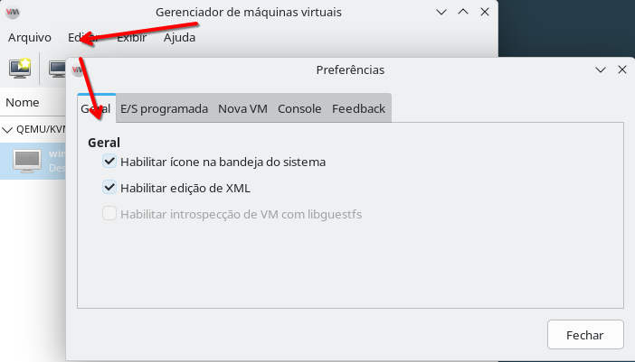  

Depois, na mesma janela, na guia **E/S programada**, faça o seguinte ajuste:  
1. Atualizar o status a cada 3 segundos
2. Obter o uso da CPU: Ligado
3. Obter E/S de disco: Ligado
4. Obter estatística de memória: Ligado  

  

Depois, na mesma janela, na guia **Nova VM**, faça o seguinte ajuste:  
1. Tipo de gráfico: Padrão do sistema (SPICE)
2. Formato de armazenamento: QCOW2
3. CPU padrão: Padrão do aplicativo
4. Firmware x86: Padrão do sistema  
   
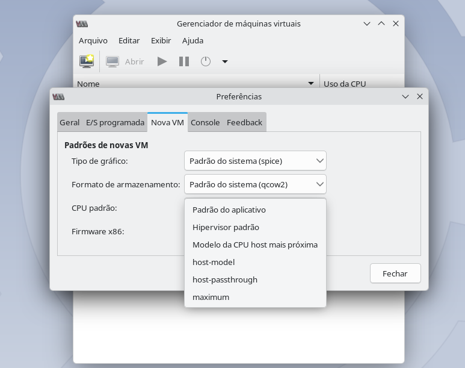  


Depois, na mesma janela, na guia **Console**, garanta que o ajuste seja:  
1. Escalonamento de console gráfico: Sempre
2. Redimensionar convidado com janela: Padrão do sistema (desligado)
3. Capturar teclas: Ctrl_L(esquerdo)+ALT_L(esquerdo)
4. Redirecionamento SPICE de USB: Redirecionamento manual apenas
5. Conectar automaticamente ao console: Ligado  

   

### CRIANDO DISCO VIRTUAL PARA HOSPEDAR A VM
Você pode usar o virt-manager para criar suas VMs e na tela em que define o tamanho do disco haverá um problema que detectei nas distros Debian e derivados: em todas as vezes que crio o disco por esse assistente embutido, os discos virtuais criados serão de tamanho fixo, ou seja, se definir ali que sua VM terá um disco de 200GB, ela terá exatamente 200GB ocupados no sistema operacional do hospedeiro. O formato qcow2 aceita discos dinâmicos, isto é, você cria um disco virtual de 200GB, mas no sistema de arquivos ele ocupará um tamanho mínimo e crescerá conforme o uso. Até que corrijam este comportamento, crie o disco no gerenciador de pools e escolha disco dinâmico; o arquivo `.qcow2` ficará no pool `default` com alocação sob demanda. Pessoalmente, acho o assistente do virt-manager burocrático, então, se quiser ser mais rápido, execute no terminal:  
```
sudo virsh vol-create-as default win2k25.qcow2 200G --format qcow2
```

Agora vamos conferir o tamanho:  
```
$ ls -lh /home/libvirt/images
total 196K
-rw------- 1 root kvm 196K Oct 17 14:31 win2k25.qcow2
```
Como pôde ver, um disco de 200GB que ocupa apenas 196K no sistema. É claro que a medida que formos instalar o sistema e todas as demais coisas, este arquivo subirá de tamanho. Na minha modesta opinião, eu criaria discos apenas pelo terminal porque podemos criar vários em sequencia, evitando o wizard burocrático e repetitivo para cada um deles.  

### VIRT-MANAGER - CRIANDO A VM
Vá em **Arquivo|Nova máquina virtual**, depois selecione **Mídia de instalação** e prossiga.

O assistente **Nova máquina virtual** tem **cinco telas** numeradas abaixo. Depois que você clicar em **Concluir** na última tela, abre-se a janela de **detalhes da VM** (personalização); essa parte não é mais “tela 6” do assistente — ela está na secção **Personalização da VM (antes de instalar)**, com passos numerados à parte.

#### Tela 1 de 5 — Tipo de mídia
Na tela **Escolha a mídia de instalação ISO ou CDROM** e então prossiga.  

#### Tela 2 de 5 — ISO e sistema convidado
Nesta tela, escolha a `.iso` de instalação do Windows e então prossiga:   
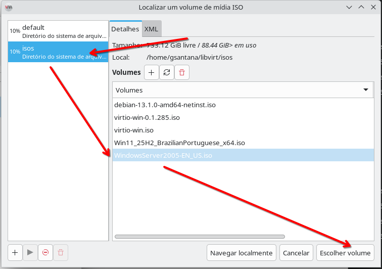     

E ao escolher a iso, defina corretamente o sistema convidado e não confie na opção auto-detecção porque as vezes ela falha, especialmente ao detectar edições do Windows Server:  
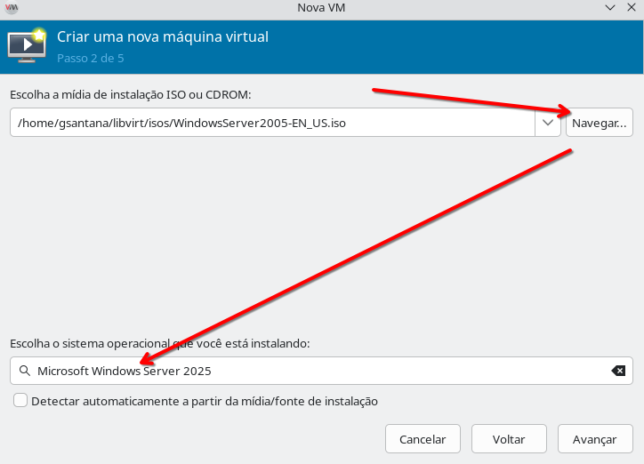   

Atenção, no caso do Windows, só escolha as edições suportadas pelo virtualizador. Caso surja uma nova versão do Windows, mas ela não apareça na lista de sistemas suportados, não tente prosseguir.  

#### Tela 3 de 5 — Memória e CPUs
Quando prosseguir, precisará decidir quanto de memória precisará usar e quantas CPUs. A quantidade de memória que escolher é definido pelos requisitos de programas que irá usar, no meu caso será 8GB de RAM usando 8 CPUs, que é metade do que tenho. Eu não costumo usar mais do que 1 VM por vez, geralmente concentro VMs por tarefas que desempenho, então quando vou programar usando o Windows tenho uma VM só para ela, para testes de automação tenho outra e assim por diante. Essa é uma dica importante, prefira ter VMs por atividade, não crie uma VM para todas as coisas porque elas podem ser voláteis, uma ora ou outra precisam ser recriadas:   
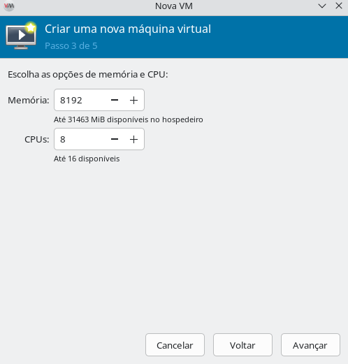     

#### Tela 4 de 5 — Disco da VM
Nesta janela, ligue a opção **Habilitar armazenamento para esta máquina virtual** e vá em **Selecionar ou criar um armazenamento personalizado**, ao clicar em **Gerenciar...** selecione o disco virtual que criamos anteriormente, ou vá para o terminal e crie uma com o comando:   
```
sudo virsh vol-create-as default win2k25-dx.qcow2 200G --format qcow2
```
No exemplo acima, estou criando um disco virtual com o nome `win2k25-dx` onde `win2k25` é um prefixo que me lembra `Windows 2025` e o sufixo `dx` me lembra o ambiente que vou instalar depois. Preparar nomes assim não é uma regra, mas ajuda bastante. E então escolha no pool `default` o seu disco virtual:  

   

E então, estará assim:  
    

E então prossiga.   


#### Tela 5 de 5 — Nome, rede e personalização
Agora vamos dar um nome, pode ser qualquer nome, mas geralmente eu uso o mesmo nome do disco virtual para facilitar o reconhecimento depois. Precisará marcar a opção **Personalizar a configuração antes de instalar** porque precisaremos acrescentar mais uma unidade de CD-ROM:
   

Depois clique em **Concluir** e é possível que apareça uma janela como a seguir perguntando se deseja que a rede virtual `default` seja ligada; responda **Sim**:   
    

### Personalização da VM (antes de instalar)

Abre-se a janela de **detalhes** da máquina virtual. Siga os **passos numerados** abaixo **nesta ordem** antes de clicar em **Iniciar a instalação**.

#### Passo 1 — Visão geral (chipset, firmware, XML)
Será apresentada a configuração de nossa VM. Vá na guia **Visão geral** e confirme que o chipset escolhido é **Q35** e o firmware é **UEFI** (OVMF); sem isso o Windows 11 em modo “padrão” costuma falhar nos requisitos:


As edições do Windows Server (até 2025) em geral **não exigem** UEFI da mesma forma que o Windows 11 cliente; para Server pode usar **BIOS** (SeaBIOS), mais simples, se preferir.

Se estiver instalando **Windows 11** com UEFI/OVMF e o instalador reclamar de **Secure Boot**, no virt-manager verifique em **Visão geral** se há opção de **Secure Boot** compatível com o seu firmware OVMF e ative-a conforme a interface permitir (varia com a versão do libvirt/edk2).

Ainda na guia **Visão geral**, abra a guia **XML**, procure uma seção `<hyperv>` assim:
```
    <hyperv>
    (...)
    </hyperv>
```
e troque este bloco acima por:
```
<hyperv mode="custom">
  <relaxed state="on"/>
  <vapic state="on"/>
  <spinlocks state="on" retries="8191"/>
  <vpindex state="on"/>
  <runtime state="on"/>
  <synic state="on"/>
  <stimer state="on">
    <direct state="on"/>
  </stimer>
  <reset state="on"/>
  <vendor_id state="on" value="KVM Hv"/>
  <frequencies state="on"/>
  <reenlightenment state="on"/>
  <tlbflush state="on"/>
  <ipi state="on"/>
</hyperv>
```
Se tiver uma CPU Intel, dentro do bloco `hyperv` acrescente também:
```
  <evmcs state="on"/>
```
Ficando mais ou menos assim:  

    

Confirme também se o bloco **clock** está assim:  
```
  <clock offset="localtime">
(...)
    <timer name="hypervclock" present="yes"/>
  </clock>
```  
#### Passo 2 — CPU
Vá na guia **CPUs** e ligue a opção **Copiar configurações de CPU do hospedeiro(host-passthrough)**:


#### Passo 3 — Memória
Vá em **Memória**; em nosso exemplo, a memória mínima e máxima é 8192MB. Não defina mínima abaixo da máxima em VMs Windows — costuma causar comportamento estranho. Marque apenas **Habilitar memória compartilhada** (KSM). Esse recurso ajuda quando várias VMs com o mesmo SO estão ligadas (deduplicação de páginas); a explicação intuitiva é “reaproveitar” memória entre guests semelhantes. O motivo prático aqui é que **Virtio-FS** (compartilhamento de pastas mais adiante) costuma exigir memória compartilhada habilitada:  
   
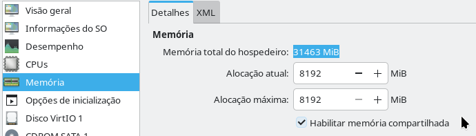    

#### Passo 4 — Disco principal (VirtIO)
Vá para a opção **Disco SATA 1** (o nome pode variar). Provavelmente o barramento estará como **SATA**; para maior desempenho, troque para **VirtIO**. Depois, expanda **Opções avançadas** e ajuste:
  
**Modo de cache** troque para **none**(nenhum);  
**Modo de descarte** troque para **unmap**(desmapear);
   
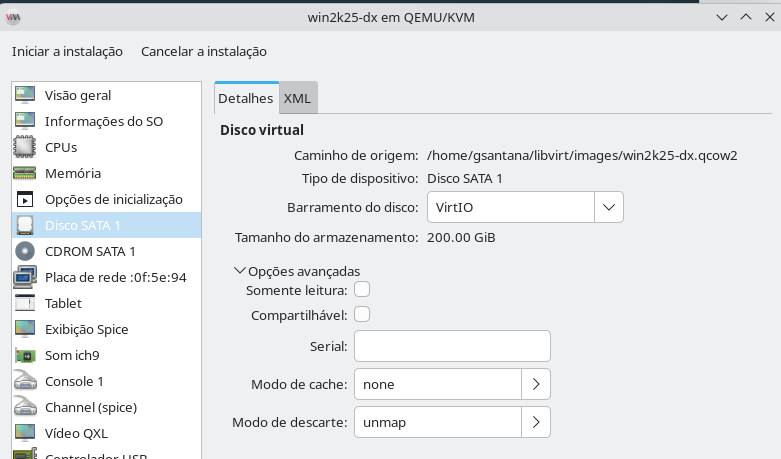   

Clique em **Aplicar**.  

Tem uma opção muito performática para o mundo Windows que é acrescentar:
* **io** com o valor **native**  
* **Detect zeroes** com o valor **unmap**  

Porém o virt-manager visualmente não traz essa opção, por isso, precisaremos adicioná-las manualmente, vá na aba **XML**, e localize o bloco `<disk …>` e provavelmente estará assim:
```xml
<disk type="file" device="disk">
  <driver name="qemu" type="qcow2" cache="none" discard="unmap"/>
  (...)
</disk>
```
No elemento `<driver .../>` acrescente os atributos que faltam, por exemplo:

```xml
<driver name="qemu" type="qcow2" cache="none" discard="unmap" io="native" detect_zeroes="unmap"/>
```

(Use o mesmo estilo de aspas que o restante do XML da sua VM — misturar `'` e `"` incorretamente impede a VM de iniciar.)

Clique em **Aplicar** para salvar. É possível que o editor visual reordene atributos; isso é normal.

#### Passo 5 — Segundo CD-ROM (virtio-win.iso)
Com o disco em **VirtIO**, o instalador do Windows não reconhece o volume até carregar o driver. Como não dá para trocar o único CD-ROM do instalador pelo `virtio-win.iso` sem quebrar o fluxo, adicione **um segundo** CD-ROM: o primeiro fica com a ISO do Windows; o segundo, com **virtio-win.iso** (veja a secção **Pré-requisitos** no início deste artigo). Vá em **Adicionar hardware** → **Dispositivo CD-ROM** → **Gerenciar...** → selecione **virtio-win.iso** → **Concluir**:   

   

E agora teremos duas unidades de CDROM:  
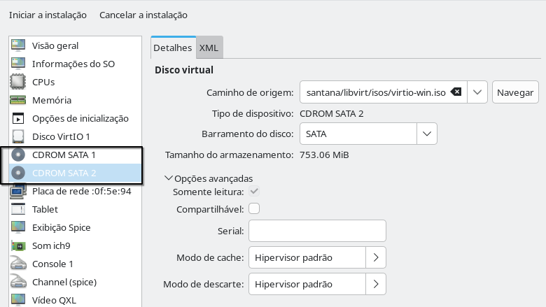   

Na primeira unidade fica a ISO do Windows; na segunda, a ISO com os drivers VirtIO.

**Opcional — RNG VirtIO:** em **Adicionar hardware**, alguns ambientes oferecem **Entropia / RNG** com modelo **virtio**; melhora a disponibilidade de aleatoriedade para criptografia. Não é obrigatório para concluir a instalação.

#### Passo 6 — Rede (VirtIO)
Agora vamos em nossa placa de rede e vamos fazer um pequeno ajuste:  
**Fonte de rede**: NAT;    
**Modelo de dispositivo**: troque para **virtio**.  
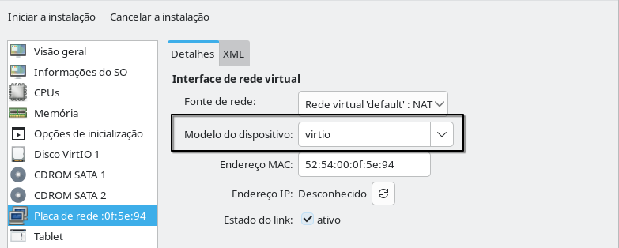   

#### Passo 7 — Canal do QEMU Guest Agent
Adicione o canal usado pelo **QEMU Guest Agent** (integração com o hipervisor: tempo, IP, desligamento limpo via libvirt, etc.). **Não confunda** com *clipboard* SPICE: copiar/colar entre host e VM depende do **SPICE agent** no convidado e dos serviços **spice-vdagentd** no Linux hospedeiro (tratado no guia [VM Windows](debian_qemu_kvm_windows.md)).

Vá em **Adicionar hardware** → **Channel** e configure:
  
Nome: **org.qemu.guest_agent.0**    
Tipo de dispositivo: **Soquete UNIX (unix)**    
Soquete automático: **ligado**  

Depois clique em **Concluir**: 
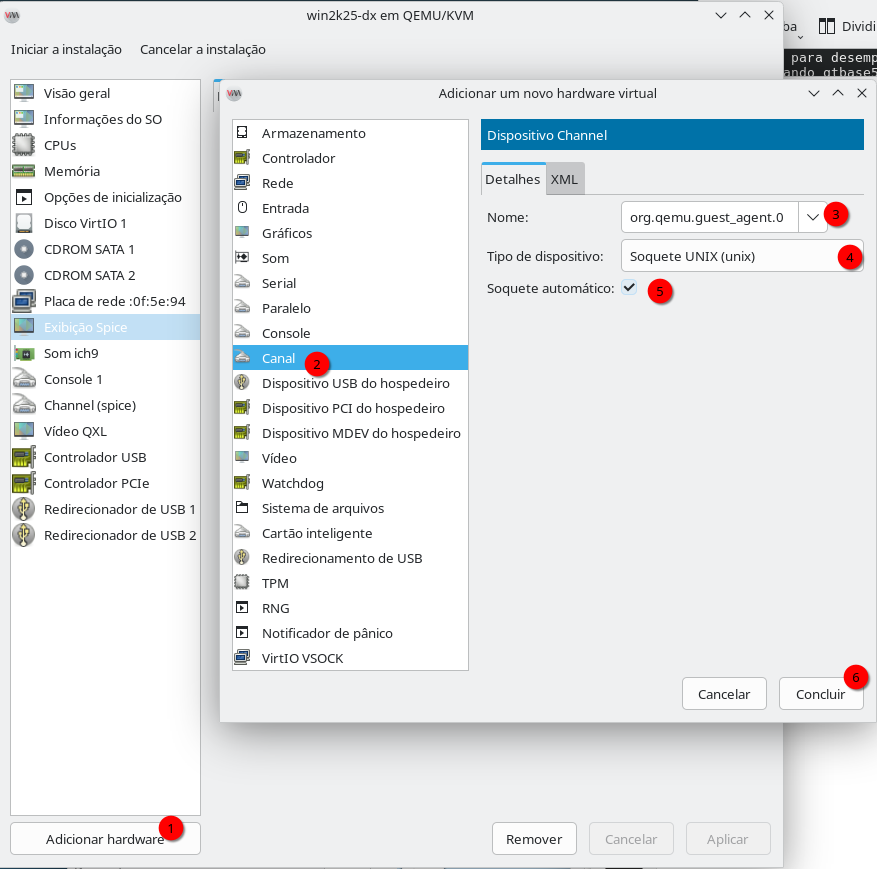  

#### Passo 8 — Vídeo QXL
Na lista de hardware, escolha o **Vídeo**, confirme que o modelo escolhido é o **QXL**:
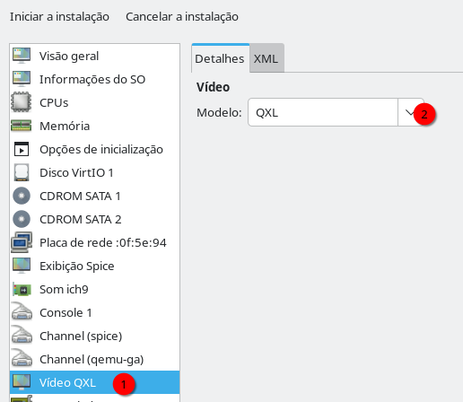   

#### Passo 9 — TPM (se necessário)
Olhe na relação de hardware, veja se há o item **TPM**, se não existir clique novamente em **Adicionar hardware** e escolha **TPM**. Certifique-se de que as seguintes propriedades estejam assim:
  
Tipo: **emulado**  
Modelo: **CRB**  
Versão: **2.0**  

Sem isso, algumas edições do Windows - como o Windows 11 - não funcionarão:
  

**OBSERVAÇÃO**: Nas edições do Windows Server, o TPM ainda não é obrigatório, então não precisa incluí-lo caso esteja usando essa edição do Windows.  


#### Passo 10 — Iniciar a instalação
Finalmente podemos começar a instalação: clique em **Iniciar a instalação** no topo da janela de detalhes da VM:  


A instalação começará, e trata-se de uma instalação comum, no entanto, seu ponteiro de mouse estará preso à essa janela, para sair dela use as teclas **Ctrl** e **Alt** do lado esquerdo do teclado.

### Instalador do Windows (drivers VirtIO durante o setup)

1. Após concordar com os termos de instalação, é comum **não aparecer nenhum disco** para instalar o Windows: o volume está em **VirtIO**, que o instalador não traz embutido. Clique em **Carregar driver** (Load Driver):  

   

2. Aponte para a pasta (Browse) na segunda unidade de CDROM onde temos o iso do VirtIO drivers para convidado, geralmente a unidade E: na pasta:   
```
E:\VioStor\2k25\amd64
```
Onde `2k25` é os drivers para Windows 2025, para o Windows 11 seria `w11` e assim por diante.
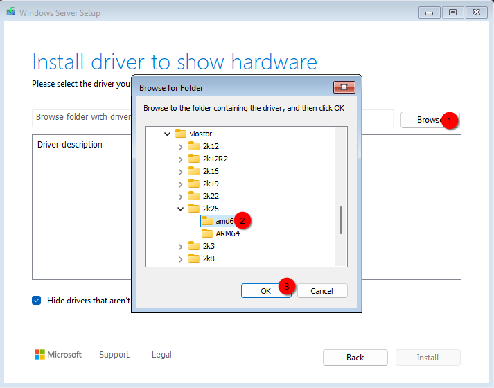   

3. Confirme a instalação deste driver:  
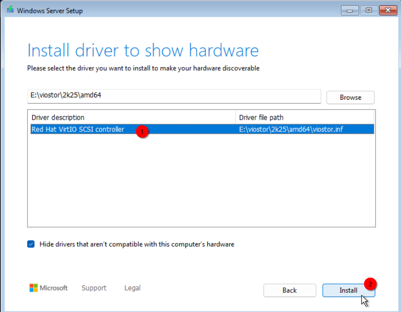   

O disco deve aparecer na lista:
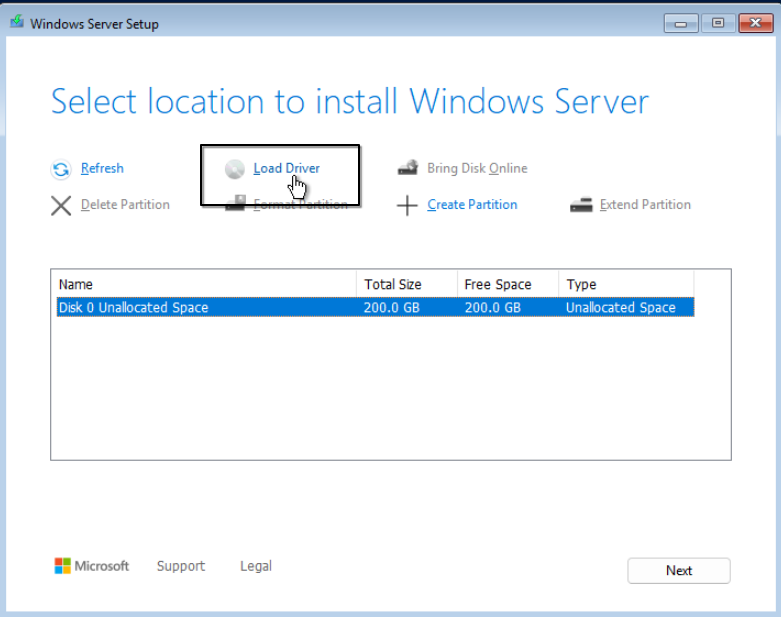   

4. Ainda falta o driver de rede: vá novamente em **Load Driver** e aponte para a pasta (Browse) na segunda unidade de CDROM onde temos o iso do VirtIO drivers para convidado, geralmente a unidade E: na pasta:   
```
E:\NetKVM\2k25\amd64
```
Onde `2k25` é os drivers para Windows 2025, para o Windows 11 seria `w11` e assim por diante:
   

5. Confirme a instalação do driver de rede:  
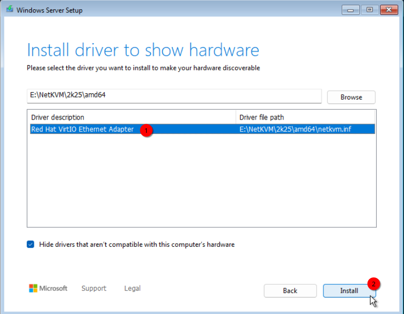   

6. Continue a instalação do Windows normalmente; com disco e rede reconhecidos, o assistente segue o fluxo habitual:  
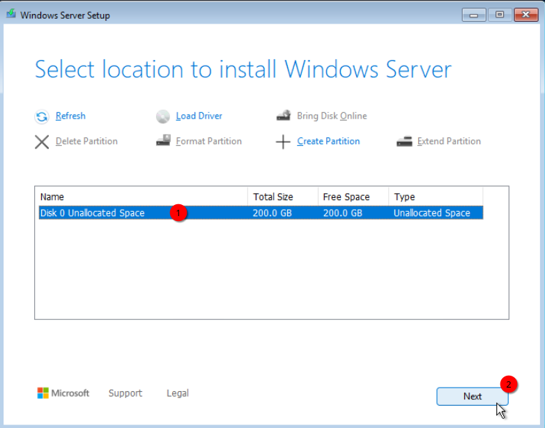   

A instalação costuma ser bem mais rápida do que em hardware convencional. 

### Pós-instalação (guest tools e integrações)

Após o boot do Windows e o primeiro login, instale as ferramentas de convidado.  
Dentro do Windows, abra a unidade de CD-ROM do **virtio-win** (letra pode variar; use o Explorador de arquivos) e execute o instalador:  
```
E:\virtio-win-guest-tools.exe
```
Execute-o e siga as instruções na tela:
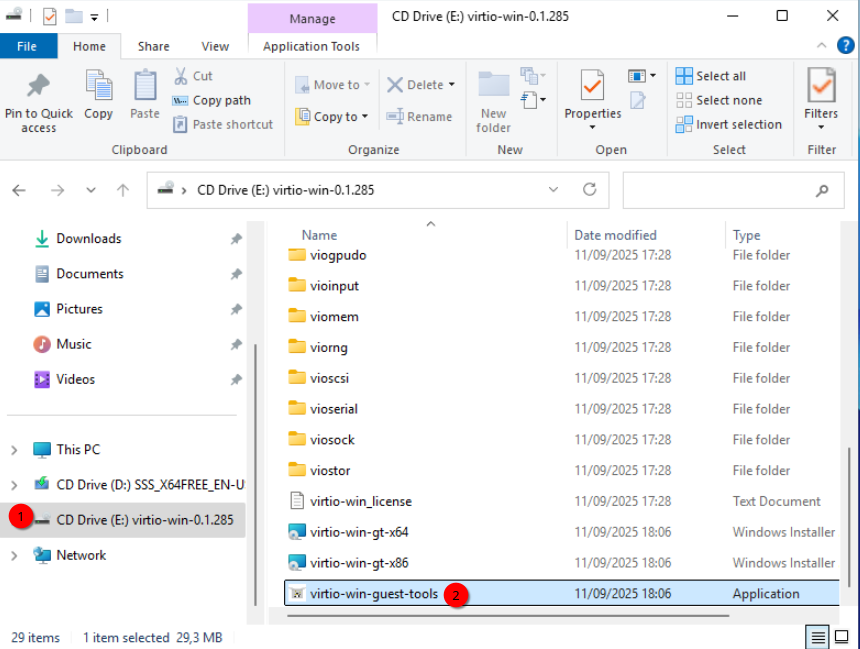   

A tela pode piscar durante a instalação. **Reinicie a VM se o instalador pedir**; caso contrário, siga e teste o redimensionamento abaixo.

Para verificar se os drivers gráficos/SPICE já respondem, no virt-manager use **Exibir** → **Escalonar a exibição** e marque **Redimensionar automaticamente a VM com a janela** (o texto exato pode variar um pouco conforme a versão):  
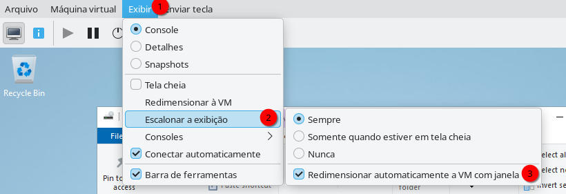   

Depois disso, costuma ser possível soltar o cursor sem **Ctrl+Alt** (esquerdo) e o Windows acompanha o tamanho da janela ao redimensionar o virt-manager.   
Se você for no topo ao centro e ficar com o ponteiro do mouse ali parado por 1s, aparecerá dois botões que estavam camuflados, um deles é para sair de tela cheia e o outro para enviar combinações de tecla como Ctrl+Alt+Del.  

Ainda nos resta instalar um driver muito importante, o `WinFsp`, sem ele, não poderemos compartilhar arquivos entre hospedeiro e convidado.  
Visite à página:  
[https://github.com/winfsp/winfsp/releases](https://github.com/winfsp/winfsp/releases)   

E então baixe a versão mais recente.  
   

Depois de instalado, execute `services.msc` como administrador e procure pelo serviço **VirtIO-FS Service**, e habilite-o para iniciar junto com o Windows:  

   

Se **VirtIO-FS Service** não iniciar de imediato, é esperado até existir um compartilhamento Virtio-FS configurado na VM; mantenha o serviço como **Automático** para quando seguir o guia de pastas compartilhadas.

Quando não precisar mais da ISO **virtio-win** na VM, pode ejetá-la no Explorador de arquivos ou remover o segundo CD-ROM no virt-manager (há um tópico específico no guia [VM Windows](debian_qemu_kvm_windows.md)).

#### Verificação rápida (recomendado)
- **Gerenciador de Dispositivos** (`devmgmt.msc`): não deve restar muitos “Dispositivo desconhecido” após o `virtio-win-guest-tools.exe` (salvo hardware que você não adicionou, ex.: impressora).
- **Serviços** (`services.msc`): procure **QEMU Guest Agent** (ou nome semelhante) **Em execução** após o pacote VirtIO — coerente com o canal configurado no **Passo 7** deste artigo.
- **Rede**: com NAT na VM, confira acesso à internet (navegador ou `ping 1.1.1.1`).
- **Hospedeiro Linux**: para clipboard SPICE estável, mantenha **spice-vdagentd** (e, se for usar WebDAV depois, **spice-webdavd**) conforme a secção **SERVIÇOS ESSENCIAIS** em [VM Windows](debian_qemu_kvm_windows.md).

---

[Retornar à página de Virtualização nativa com QEMU+KVM usando VM/Windows](debian_qemu_kvm_windows.md)   

