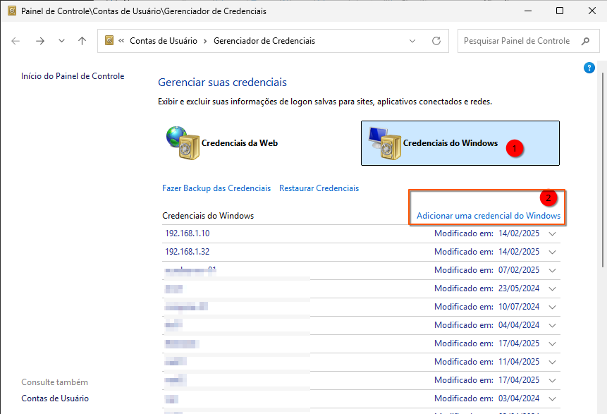
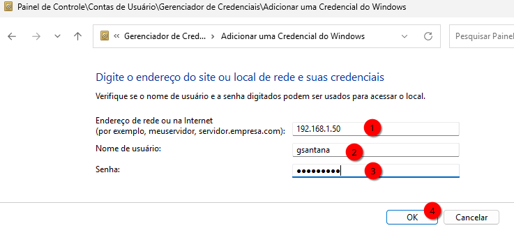
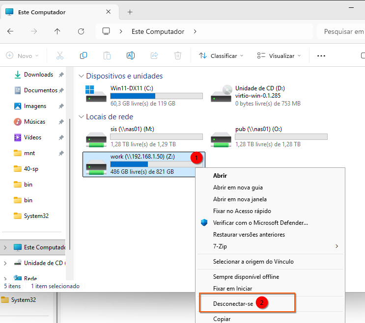
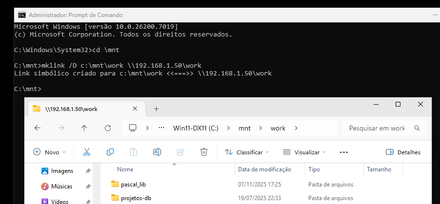

# Compartilhamento de Pastas com Samba no Debian 13 e Acesso via Windows

Este documento fornece um guia completo, passo a passo, para configurar um compartilhamento de rede (SMB/CIFS) seguro usando o Samba no Debian 13 (Trixie) e acessá-lo a partir de um cliente Windows, utilizando um link simbólico local.  
Usar um compartilhamento como o descrito a seguir é mais familiar para usuários do mundo Windows; é provável que prefiram este método conhecido em vez dos métodos virtio-fs ou virtio-webdav.  

Para o correto entendimento, nos exemplos a seguir, assumiremos que:
**IP do hospedeiro**: 192.168.1.50  
**Usuário/conta do hospedeiro**: gsantana  

## 1\. Configuração do Servidor Debian/Ubuntu (Samba)

As etapas a seguir devem ser executadas no seu servidor ou máquina Linux Debian/Ubuntu para configurar o compartilhamento da pasta **`/home/w`** (conforme o exemplo de share `[w]` mais abaixo).

### 1.1. Instalação do Samba

Instale os pacotes necessários para o servidor Samba e as ferramentas de cliente para testes.

```bash
sudo apt update
sudo apt install -y samba smbclient cifs-utils 
```

Mas, dependendo da distro Debian-like ou Ubuntu-like, o servidor de domínios também pode ser habilitado. Como não precisamos dele, para garantir que não esteja ativo, execute também:  

```bash
sudo systemctl disable samba-ad-dc
```

### 1.2. Criação do grupo `sambashare` e associação ao usuário
É necessário criar um grupo para que os compartilhamentos possam ser feitos a mais de um usuário.  
Adiante no artigo, criaremos uma pasta comum que será compartilhada com todos os membros do grupo `sambashare`.  

Então, **crie o grupo** e **adicione** o usuário `gsantana` nele:

```bash
sudo groupadd -f sambashare
sudo usermod -aG sambashare gsantana
```

Para a sessão atual reconhecer o novo grupo sem reboot/logout, você pode abrir um novo terminal ou usar:

```bash
newgrp sambashare
```

### 1.3. Criação e Configuração do Usuário Samba

O Samba gerencia sua própria base de dados de senhas para acesso à rede. O usuário do sistema (`gsantana`) deve ser adicionado a esta base de dados.

1. **Definir a Senha do Samba:**
   Use o comando `smbpasswd -a` para adicionar o usuário `gsantana` ao banco de dados do Samba e definir uma senha de rede.
   
   ```bash
   sudo smbpasswd -a gsantana
   ```
   
   (Você será solicitado a digitar e confirmar a nova senha do Samba.)

2. **Habilitar o Usuário (Garantia):**
   
   ```bash
   sudo smbpasswd -e gsantana
   ```

### 1.4. Configuração do Compartilhamento (`/etc/samba/smb.conf`)

Edite o arquivo principal de configuração para definir o novo recurso de compartilhamento.

1. **Backup da Configuração Original:**
   
   ```bash
   sudo cp /etc/samba/smb.conf /etc/samba/smb.conf.bak
   ```

2. **Editar o Arquivo de Configuração:**
   
   ```bash
   sudo editor /etc/samba/smb.conf
   ```

3. **Solução de Compatibilidade para Links Simbólicos (Symlinks)**  
   A incompatibilidade na visualização de pastas ou arquivos dentro do Windows ocorre frequentemente quando o Samba encontra **links simbólicos** que apontam para fora do diretório compartilhado. Por padrão, o Samba tenta aplicar as extensões e atributos de segurança do UNIX (permissões, proprietário, grupo) à conexão SMB/CIFS, o que pode confundir clientes Windows.  
   
   Para garantir que links simbólicos funcionem e que o Windows consiga interpretar corretamente os atributos das pastas e arquivos:  
   
   Adicione a diretiva `unix extensions = no` na seção `[global]` do arquivo `/etc/samba/smb.conf`. Essa linha melhora a compatibilidade com o Windows, especialmente ao lidar com links simbólicos:  
   
   ```ini
   [global]
       (...)
       workgroup = WORKGROUP
       unix extensions = no    ; <<< Adicionar esta linha
       allow insecure wide links = yes  ; necessário quando usar "wide links = yes"
       (...)
   ```
   
   Se você tiver um domínio em sua rede, troque **WORKGROUP** pelo nome do seu domínio, por exemplo **LOCALDOMAIN**. Isso acelera o trabalho porque, ao mapear unidades, você não precisa informar o usuário como **localdomain\gsantana**; apenas **gsantana** será suficiente.      

4. **Adicionar o novo compartilhamento:**
   Adicione a seção a seguir ao **final** do arquivo. Ela restringe o acesso ao usuário `gsantana` e aos membros do grupo `sambashare`, permitindo leitura/escrita.

```ini
[w]
    comment = Pasta de Trabalho
    path = /home/w
    browseable = yes
    read only = no
    # Permite acesso ao usuário e também a membros do grupo sambashare
    valid users = gsantana @sambashare
    public = no
    writable = yes
    follow symlinks = yes
    wide links = yes

    # Máscaras de permissão
    create mask = 0660
    directory mask = 2770
    force create mode = 0660
    force directory mode = 2770

    # Configurações de segurança para mapeamento de usuário
    force user = gsantana
    force group = sambashare
    inherit permissions = yes
```

5. **Salvar e Sair** do editor.

### 1.5. Verificação de Permissões no Linux

Confirme se o usuário `gsantana` possui as permissões corretas no sistema de arquivos para a pasta a ser compartilhada.
Defina `gsantana` como dono (se necessário):  

```bash
sudo chown -R gsantana:sambashare /home/w
```

Garanta permissões coerentes para o usuário e grupo:  

```
sudo find /home/w -type d -exec chmod 2770 {} +
sudo find /home/w -type f -exec chmod 0660 {} +
```

### 1.6. Reinício e Teste do Serviço

1. **Verificar a Sintaxe da Configuração:**
   
   ```bash
   testparm
   ```
   
   Confirme que o `smb.conf` foi carregado sem erros.

2. **Reiniciar o Serviço SMB:**
   
   ```bash
   sudo systemctl restart smbd
   sudo systemctl restart nmbd
   ```

3. **Iniciar o Serviço SMB após o boot:**
   
   ```bash
   sudo systemctl enable smbd
   sudo systemctl enable nmbd
   ```

4. **Testar o Acesso Localmente (Opcional):**
   
   ```bash
   smbclient //localhost/w -U gsantana
   ```
   
   Digite a senha do Samba e se estiver correta, o prompt `smb: \>` confirma a conexão bem-sucedida e se quiser usar alguns comandos, tente o `ls` e depois o `quit`.  

-----

## 2\. Acesso e Mapeamento no Cliente Windows

Após a configuração no Debian, o compartilhamento pode ser acessado em qualquer máquina Windows na mesma rede.

### 2.1. Teste de Conexão Inicial

1. Obtenha o **Endereço IP** do seu servidor Debian/Ubuntu (e.g., usando `ip a` no terminal Linux). Mapear usando o nome não funciona muito bem com VMs usando NAT(provavelmente nosso caso).  
2. No Windows, pressione **`Win + R`** para abrir o **Executar**.
3. Digite o caminho UNC do compartilhamento:
   
   ```
   \\192.168.1.50\w
   ```
4. Insira o nome de usuário (`gsantana`) e a **senha do Samba**. Marque a opção para lembrar credenciais.

### 2.2. Credenciais do Windows

Precisamos que o Windows memorize as credenciais da nossa máquina hospedeira. Digamos que, neste exemplo, o IP dela seja 192.168.1.50. Então, no Windows, procure pelo **Gerenciador de Credenciais**, vá em **Credenciais do Windows** e clique em **Adicionar uma credencial do Windows**:   
  
E então informe as suas credenciais para o host (192.168.1.50):  
  
Agora que nossa credencial está incluída, vamos aos links simbólicos...

### 2.3. Recomendação: Mapeamento Local com Link Simbólico (Symlink)

Uma vez que você manteve sua senha/credencial “lembrada”, o Windows guardará suas credenciais; da próxima vez que acessar o compartilhamento, você não precisará fornecer a senha novamente.  
Isso é muito bom, mas pode ficar ainda melhor: para um acesso mais integrado e transparente, crie um link simbólico que aponta o caminho de rede para um diretório local.  
Iremos criar a pasta **`C:\@mnt`** e, dentro dela, links simbólicos que apontam para o compartilhamento; com isso, você não precisa mais usar letras de drive para acessá-lo.  

Antes de prosseguir, remova eventuais unidades mapeadas (ex.: `Z:`) para este mesmo compartilhamento. Se o Windows Explorer perceber que `C:\@mnt\w` é o mesmo destino que `Z:`, tanto o Explorer quanto janelas de diálogo de aplicativos tendem a “saltar” para a letra do drive, tratando o caminho como atalho em vez de pasta normal.


**Requer: Prompt de Comando executado como Administrador.**

1. **Abrir o Prompt de Comando:**
   Procure por `cmd`, clique com o botão direito e selecione **"Executar como administrador"**.

2. **Criar o Diretório de Montagem Local:**
   Crie a pasta que servirá de destino para o link simbólico.
   
   ```cmd
   mkdir C:\@mnt   
   ```
   
   Você pode usar **C:\@mnt** caso queira que essa pasta seja listada como sendo a primeira pasta a ser vista no Explorer; fica esteticamente melhor, na minha humilde opinião.

3. **Criar o Link Simbólico:**
   Use o comando `MKLINK` com a opção `/D` (para diretórios), apontando o caminho local (`C:\@mnt\w`) para o caminho de rede (UNC).
   
   ```cmd
   cd \@mnt
   mklink /D C:\@mnt\w \\192.168.1.50\w
   ```
   
   O resultado será:  
   
   > Link simbólico criado para C:\@mnt\w <<===>> \\192.168.1.50\w
   
   Você pode repetir o processo para outras pastas do hospedeiro e até mesmo para outras unidades de rede. Sinceramente, acho o uso de letras de drive confuso para unidades de rede; é mais interessante usar links simbólicos.

6. **Resultado:**
   A pasta compartilhada do Linux agora é acessível diretamente no seu sistema Windows através do caminho local **`C:\@mnt\w`**:
   


---

## 4\. Configuração do Firewall (UFW) no Debian/Ubuntu

Se você tem o firewall instalado, então vai precisar liberar as seguintes portas:  

* **Portas NetBIOS:** UDP 137, UDP 138
* **Porta SMB/CIFS:** TCP 139 (para compatibilidade legada)
* **Porta Net Logon/Replication:** TCP 445 (a porta SMB moderna e mais comum)

[Recapitule o documento a página sobre Firewall no Debian](https://github.com/gladiston/debianlinux/blob/main/docs/debian_firewall.md)

-----

[Retornar à página de Virtualização nativa com QAEMU+KVM Usando VM/Windows](debian_qemu_kvm_windows.md)
