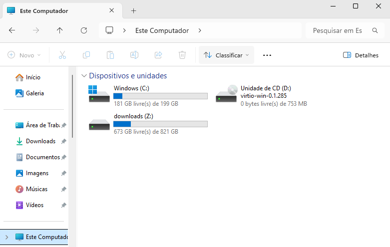

# VIRT-MANAGER - COMPARTILHANDO ARQUIVOS VIA Virtio-FS + WinFsp
Para compartilhar arquivos entre o sistema hospedeiro e convidado, você pode usar o virtiofs+WinFsp. Esse é o método com melhor desempenho entre os que costumamos usar.  
Siga as instruções abaixo:  

Depois de iniciar a VM, acesse a página do WinFsp no link abaixo:  
[https://github.com/winfsp/winfsp/releases](https://github.com/winfsp/winfsp/releases)  
E baixe a última versão disponível:   
  

Execute `services.msc` e veja se os serviços estão habilitados:  
**VirtIO-FS Service**  
   

**WinFsp.Launcher**  
   

Depois de conferir que os serviços aparecem corretamente, **desligue a VM Windows** — por enquanto não precisamos dela.  

## Uma pasta no Linux vira um “volume” no Windows

**O que você precisa entender antes de configurar**

1. **Uma exportação por vez (no sentido prático)**  
   Com WinFsp + Virtio-FS, o Windows costuma expor **uma pasta do hospedeiro** como **uma letra de unidade** (por exemplo `Z:`). Não é como montar dez pastas diferentes e ganhar dez letras automaticamente com o mesmo fluxo simples — por isso, no virt-manager, pense em **uma pasta raiz** que o Windows enxergará como um “disco” ou volume.

2. **“Volume” aqui é o nome da configuração, não um disco físico**  
   No Linux você escolhe um diretório (ex.: `~/work`). No assistente do virt-manager isso entra como **volume/pool** de sistema de arquivos. No Windows, esse conteúdo aparece como **uma unidade**; não é necessário confundir com partições reais do disco.

3. **Se precisar de várias pastas “de verdade” (Downloads, documentos, projetos)**  
   No **hospedeiro** você contorna essa limitação assim: mantém **uma única pasta exportada** (ex.: `~/work`) e, **dentro dela**, junta o que precisa com **`bind mount`**: você monta pastas reais do sistema em subpastas vazias dentro de `~/work`. Para o Windows continua sendo **uma** unidade; por baixo, no Linux, são vários diretórios reunidos num só lugar.  
   **Diferença rápida em relação a link simbólico:** o kernel trata `bind mount` como o próprio conteúdo daquele caminho; já um symlink é outro tipo de arquivo. Para o Virtio-FS enxergar tudo de forma previsível, o fluxo com **uma árvore sob `~/work` + bind mounts** costuma ser o mais seguro.

4. **Por que isso importa em VM**  
   Assim você **não exporta o `$HOME` inteiro** e ainda assim acessa Downloads, projetos etc., tudo sob **um** `Source Path` coerente.

Neste tutorial usamos a pasta `~/work` no Linux como única pasta exportada para o Windows. Vamos criá-la:
```bash
mkdir -p ~/work            # pasta vazia
```
Vamos criar um arquivo dentro só para lembrar que esta pasta é um volume exportado (e não um disco comum):
```bash
echo Este é um volume exportado do Linux > ~/work/readme.txt
echo ~/work >> ~/work/readme.txt
```
Os exemplos com `mount --bind` para várias pastas vêm na seção **OPÇÃO 1**; por ora, foque em fazer esta primeira exportação funcionar.

## Configurar o volume no virt-manager
Com a VM desligada, usando o virt-manager, vá em **Mostrar os detalhes do hardware virtual**:  
   

Você precisará criar um **pool**, para isso adicione um novo hardware e escolha um novo hardware **Sistema de arquivos(FileSystem)**:  
   

Na tela acima, perceba que **Driver** é **virtiofs**.  

Em **Caminho de origem** você precisará clicar em **Navegar** e então selecionar um **pool**. Um **pool**, neste exemplo, é o “recipiente” no libvirt que aponta para onde estão os arquivos que você quer ver na VM — em geral uma pasta no seu sistema. Como `~/work` fica dentro do seu `$HOME` (ex.: `/home/gsantana`), é esse o **pool** a criar:  
   

Uma vez criado o volume, a parte seguinte é apenas selecionar a pasta `~/work`:   
   

Agora que os parâmetros corretos apareceram, confira se estão assim:  

| Campo | Valor | Observação |
|-------|-------|------------|
| **Nome** | `work` | É apenas um nome; poderia ser qualquer um, mas vamos padronizar para usar o mesmo nome da pasta — isto facilita. |
| **Tipo** | `dir` | Indica que se aponta para um diretório; há outras opções que você poderá estudar mais tarde. |
| **Caminho de destino** | sua pasta `~/work` | Tem que ser um caminho direto; não use links. |

Depois clique em **Concluir**.  

**Por que não dá para só digitar `/home/gsantana/work` e pronto?**

Quando você termina o assistente, o **Caminho de origem** aparece como **`/home/gsantana/work`** — e parece redundante ter passado por “criar pool” e “escolher pasta”. O ponto é este:

1. **O libvirt não pensa só em “caminho solto”.** Ele organiza armazenamento em **pools** (pastas de armazenamento, LVM, etc.). O Virtio-FS precisa de um **caminho que o libvirt já conheça** como parte de um desses pools.
2. **O assistente existe para registrar esse vínculo.** Você cria o pool (no exemplo, ligado ao seu `$HOME`) e **só então** escolhe `~/work` **dentro** dele. Assim o XML da VM fica consistente: origem válida para o hypervisor, não um texto digitado à mão que o libvirt não validou.
3. **Se você pular o pool e apontar para qualquer pasta**, pode até “passar” em versões novas do virt-manager, mas é exatamente aí que costumam aparecer **VM que não sobe**, **compartilhamento que some** ou **caminho que o QEMU não resolve** — porque a configuração foge do modelo que o libvirt espera.

**Regra prática:** sempre que o virt-manager oferecer o fluxo **pool → pasta dentro do pool**, use esse fluxo. É o caminho suportado e previsível.

Na janela final, fica assim:
   

| Campo | Valor | Observação |
|-------|-------|------------|
| **Driver** | `virtiofs` | É o nome do driver |
| **Caminho de origem** | `/home/gsantana/work` | O conteúdo que a VM passa a acessar no Windows |
| **Caminho de destino** |`work` | É apenas um nome qualquer, para facilitar damos o mesmo nome da pasta. |

Se quiser **só leitura** no Windows (a VM não grava nessa pasta), marque a opção **Exportar sistema de arquivos como montagem somente leitura**.

Depois clique em **Concluir** para finalizar.   

### Vamos ao Windows
Inicie sua VM Windows.
Depois, execute `services.msc` e veja se os serviços estão habilitados:  
**VirtIO-FS Service**  
   

**WinFsp.Launcher**  
   

Sem o `WinFsp`, o serviço `Virtio-FS` não inicia e a unidade referente ao `Source Path` escolhido não aparece. Você pode abrir o `services.msc` no Windows e ver que o serviço não sobe sem o `WinFsp` instalado. 

Isso acontece porque o `WinFsp` entra em ação quando o serviço `Virtio-FS` sobe: ele lê o `Source Path` e monta a letra (por exemplo `Z:`). O problema é que **só o primeiro** `Source Path` costuma ser atendido nesse fluxo; os demais, se existirem, não viram unidades extras. Se você criar outro `Source Path` chamado `docs` no hospedeiro, essa segunda “unidade” pode não aparecer. Isso **ocorre** porque, no Windows, o `WinFsp` costuma rodar **uma instância por vez** com o serviço `Virtio-FS`. Se precisar de mais pontos de montagem, há duas saídas:  


### OPÇÃO 1 - CONSOLIDE TUDO NUM ÚNICO PONTO DE ENTRADA
Consolide todas as pastas necessárias numa **única** pasta maior. Para isso, use **`bind mount`** (não confunda com atalho de link simbólico no sentido de atalho do Explorer):
```
mkdir -p /home/gsantana/work            # pasta vazia
mkdir -p /home/gsantana/work/downloads  # pasta vazia
mkdir -p /home/gsantana/work/docs       # pasta vazia

# usando `bind mounts`:
sudo mount --bind /home/gsantana/Downloads /home/gsantana/work/downloads
sudo mount --bind /home/gsantana/docs /home/gsantana/work/docs
```
Onde:  
* **`/home/gsantana/Downloads`** é uma pasta real com arquivos dentro; o `mount --bind` encaixa esse conteúdo na pasta vazia **`/home/gsantana/work/downloads`**.  
* **`/home/gsantana/docs`** é outra pasta real; o bind monta esse conteúdo em **`/home/gsantana/work/docs`**.  
E você vai *linkando* (mount --bind) dessa forma todas as pastas de que precisa para dentro de **/home/gsantana/work**.   
Em seguida defina o `Source Path` como `/home/gsantana/work` e você terá todas as subpastas num **único** ponto acessível na VM Windows.  
Essa é a opção que eu prefiro; dá até para automatizar com um script que monta tudo o que preciso dentro de **~/work/**.


### OPÇÃO 2 - MAPEIE UNIDADES POR DENTRO DO WINDOWS
Essa é uma opção que eu uso só se não tiver jeito: ela vai criando uma letra de drive para cada `Source Path`.  
Dentro do Windows, execute outra instância manualmente com o comando:  
```
   "C:\Program Files\Virtio-Win\VioFS\virtiofs.exe" work X:
```
Isso criará a letra Z: (ou que estiver disponível) para `Source Path` definido como **docs**.  Você terá de criar um `.bat` para mapear cada letra de drive para cada `Source Path` e depois colocá-lo na auto inicialização do seu perfil, assim não precisará executar estes comandos todas as vezes.  

Assim que esses serviços estiverem em execução, abra o Explorer de novo: as pastas exportadas (no exemplo, `Downloads`) passam a aparecer como unidades:  

   

## SEGURANÇA
Para a segurança do seu sistema hospedeiro e do convidado:  
1. Você pode criar uma pool para seu $HOME, mas não deve exportar seu $HOME inteiro para dentro de uma VM.  
2. Aprenda a exportar como `Source Path` apenas as pastas de que aquela VM precisará. Além de mais seguro, limita programas que fazem **telemetria**, mas que no fundo são **spywares** que ficam bisbilhotando seu sistema.   
3. Minha preferência: crie uma pasta no estilo **work** e use *bind mounts* para reunir só o que essa VM precisa dentro desse `Source Path`.
4. Se você usa Delphi, trabalhe direto na unidade **work** (seja qual for a letra que o Windows der), mas evite que o projeto dependa de **links simbólicos** apontando para essa unidade — o Delphi costuma falhar ao resolver arquivos por symlink aí, mesmo com os dados presentes. Já symlinks para **compartilhamento de rede** costumam funcionar bem com o Delphi.  


## Dicas do YouTube

Este vídeo mostra o uso do **Virtio-FS** no Proxmox, reforça o ganho de desempenho e compara com métodos mais lentos, como WebDAV:

[COMPARTILHANDO ARQUIVOS ENTRE VMs NO PROXMOX? VEJA O PODER DO VIRTIO-FS\!](https://www.youtube.com/watch?v=1kGtxAVFIqc)  

---

[Voltar à página de virtualização nativa com QEMU/KVM — VM Windows](debian_qemu_kvm_windows.md)   


