# VIRT-MANAGER - COMPARTILHANDO ARQUIVOS VIA Virtio-FS + WinFsp
Para compartilhar arquivos entre o sistema hospedeiro e o convidado, você pode usar o Virtio-FS com o WinFsp. Esse é o método com melhor desempenho entre os que costumamos usar.  
Siga as instruções abaixo.  

Depois de iniciar a VM, acesse a página do WinFsp no link abaixo:  
[https://github.com/winfsp/winfsp/releases](https://github.com/winfsp/winfsp/releases)  
Baixe a última versão disponível:   
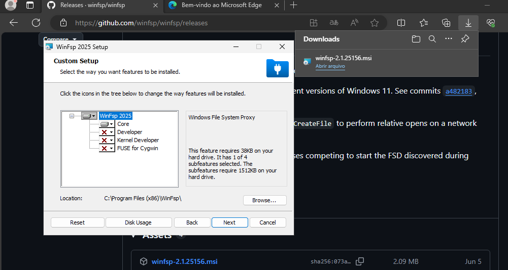  

Execute `services.msc` e veja se os serviços estão habilitados:  
**VirtIO-FS Service**  
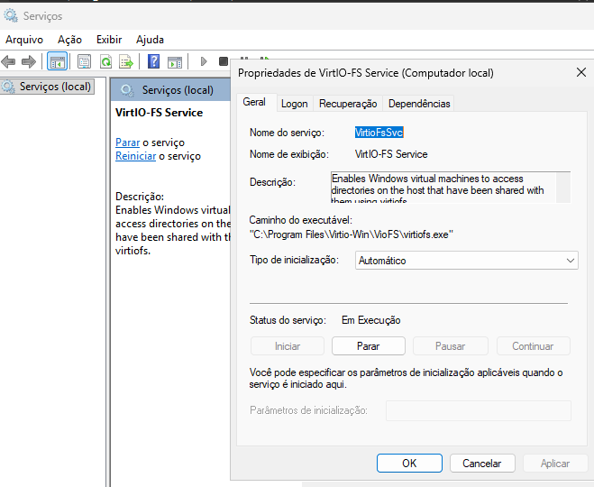   

**WinFsp.Launcher**  
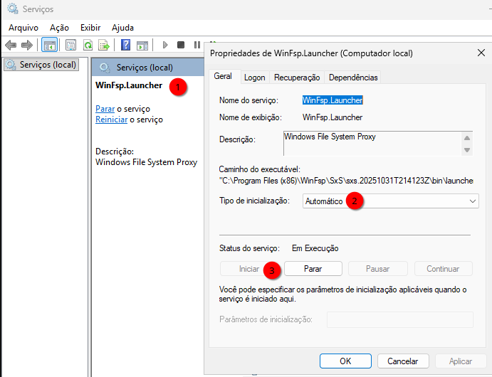   

Depois de conferir que os serviços aparecem corretamente, **desligue a VM Windows** — por enquanto não precisamos dela.  

## Uma pasta no Linux vira um “volume” no Windows

**O que você precisa entender antes de configurar**

1. **Uma exportação por vez (no sentido prático)**  
   Com WinFsp + Virtio-FS, o Windows costuma expor **uma pasta do hospedeiro** como **uma letra de unidade** (por exemplo `Z:`). Não é como montar dez pastas diferentes e ganhar dez letras automaticamente com o mesmo fluxo simples — por isso, no virt-manager, pense em **uma pasta raiz** que o Windows enxergará como um “disco” ou volume.

2. **“Volume” aqui é o nome da configuração, não um disco físico**  
   No Linux você escolhe um diretório (ex.: `~/work`). No assistente do virt-manager isso entra como **volume/pool** de sistema de arquivos. No Windows, esse conteúdo aparece como **uma unidade**; não é necessário confundir com partições reais do disco.

3. **Se precisar de várias pastas “de verdade” (Downloads, documentos, projetos)**  
   No **hospedeiro** você contorna essa limitação assim: mantém **uma única pasta exportada** (ex.: `~/work`) e, **dentro dela**, junta o que precisa com **`bind mount`**: você monta pastas reais do sistema em subpastas vazias dentro de `~/work`. Para o Windows continua sendo **uma** unidade; por baixo, no Linux, são vários diretórios reunidos num só lugar.  
   **Diferença rápida em relação a um link simbólico:** o kernel trata `bind mount` como o próprio conteúdo daquele caminho; já um symlink é outro tipo de arquivo. Para o Virtio-FS enxergar tudo de forma previsível, o fluxo com **uma árvore sob `~/work` + bind mounts** costuma ser o mais seguro.

4. **Por que isso importa em VM**  
   Assim você **não exporta o `$HOME` inteiro** e ainda assim acessa Downloads, projetos etc., tudo sob **um** `Source Path` coerente.

Neste tutorial usamos a pasta `~/work` no Linux como única pasta exportada para o Windows. Vamos criá-la:
```bash
mkdir -p ~/work            # pasta vazia
```
Vamos criar um arquivo na pasta só para lembrar que ela é um volume exportado (e não um disco comum):
```bash
echo Este é um volume exportado do Linux > ~/work/readme.txt
echo ~/work >> ~/work/readme.txt
```
Os exemplos com `mount --bind` para várias pastas vêm na seção **OPÇÃO 1**; por ora, foque em fazer esta primeira exportação funcionar.

## Configurar o volume no virt-manager
Com a VM desligada, usando o virt-manager, vá em **Mostrar os detalhes do hardware virtual**:  
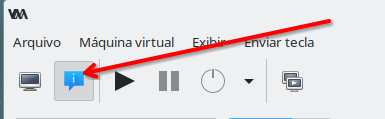   

Você precisará criar um **pool**. Para isso, adicione um novo hardware e escolha **Sistema de arquivos (File system)**:  
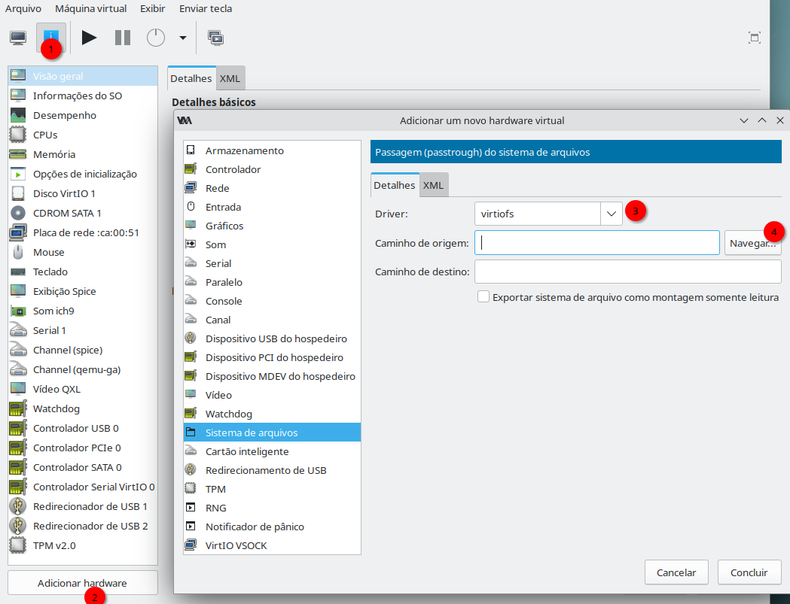   

Na tela acima, verifique se o **Driver** está como **virtiofs**.  

Em **Caminho de origem** você precisará clicar em **Navegar** e então selecionar um **pool**. Um **pool**, neste exemplo, é o “recipiente” no libvirt que aponta para onde estão os arquivos que você quer ver na VM — em geral uma pasta no seu sistema. Como `~/work` fica dentro do seu `$HOME` (ex.: `/home/gsantana`), é esse o **pool** a criar:  
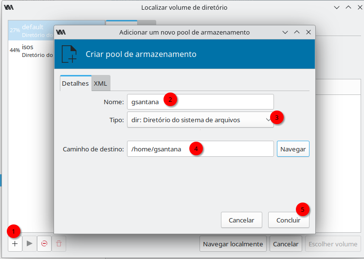   

Uma vez criado o volume, a parte seguinte é apenas selecionar a pasta `~/work`:   
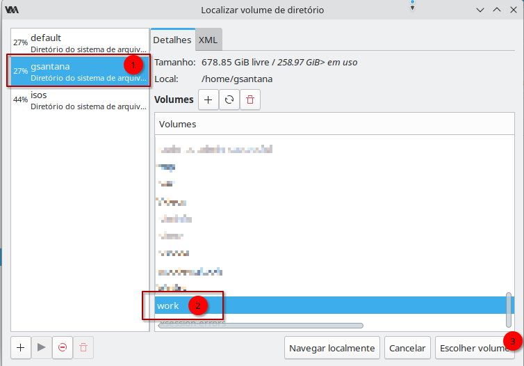   

Agora que os parâmetros corretos apareceram, confira se estão assim:  

| Campo | Valor | Observação |
|-------|-------|------------|
| **Nome** | `work` | É apenas um nome; poderia ser qualquer um, mas vamos padronizar para usar o mesmo nome da pasta — isto facilita. |
| **Tipo** | `dir` | Indica que o destino é um diretório; há outras opções que você poderá estudar depois. |
| **Caminho de destino** | sua pasta `~/work` | Tem que ser um caminho direto; não use links. |

Depois clique em **Concluir**.  

**Por que não dá para só digitar `/home/gsantana/work` e pronto?**

Quando você termina o assistente, o **Caminho de origem** aparece como **`/home/gsantana/work`** — e parece redundante ter passado por “criar pool” e “escolher pasta”. O ponto é este:

1. **O libvirt não pensa só em “caminho solto”.** Ele organiza armazenamento em **pools** (pastas de armazenamento, LVM, etc.). O Virtio-FS precisa de um **caminho que o libvirt já conheça** como parte de um desses pools.
2. **O assistente existe para registrar esse vínculo.** Você cria o pool (no exemplo, ligado ao seu `$HOME`) e **só então** escolhe `~/work` **dentro** dele. Assim o XML da VM fica consistente: origem válida para o hypervisor, não um texto digitado à mão que o libvirt não validou.
3. **Se você pular o pool e apontar para qualquer pasta**, pode até “passar” em versões novas do virt-manager, mas é exatamente aí que costumam aparecer **VMs que não sobem**, **compartilhamentos que somem** ou **caminhos que o QEMU não resolvem** — porque a configuração foge do modelo que o libvirt espera.

**Regra prática:** sempre que o virt-manager oferecer o fluxo **pool → pasta dentro do pool**, use esse fluxo. É o caminho suportado e previsível.  

Na janela final, fica assim:  
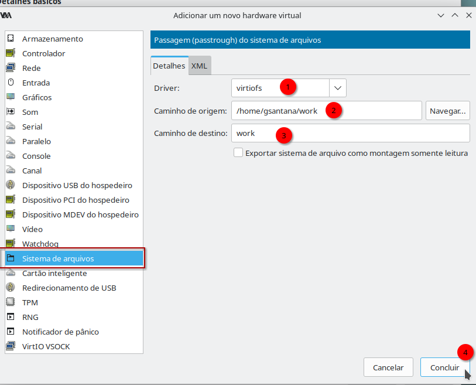   

| Campo | Valor | Observação |
|-------|-------|------------|
| **Driver** | `virtiofs` | É o nome do driver |
| **Caminho de origem** | `/home/gsantana/work` | O conteúdo que a VM passa a acessar no Windows |
| **Caminho de destino** | `work` | Nome arbitrário; para facilitar, usamos o mesmo nome da pasta. |

Se quiser **só leitura** no Windows (a VM não grava nessa pasta), marque a opção **Exportar sistema de arquivos como montagem somente leitura**.

Depois clique em **Concluir** para finalizar.   

### Vamos ao Windows

Inicie a VM Windows.  
Em seguida, execute `services.msc` e verifique se os serviços estão habilitados:  
**VirtIO-FS Service**  
   

**WinFsp.Launcher**  
   

Se esses serviços estiverem corretamente inicializados, você verá a unidade `Z:` no Windows:   
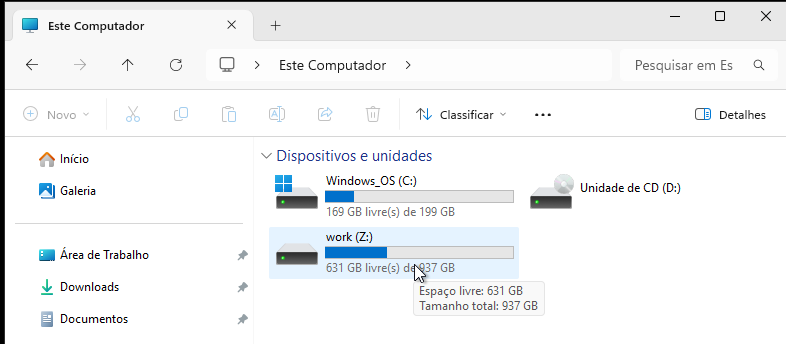      

O Windows costuma atribuir letras de unidade a partir de `Z:`; por isso a unidade aparece como `Z:`. Dá para mudar? Sim, é **possível**: no **Prompt de Comando** ou no **Terminal** do Windows, execute:
```cmd
"C:\Program Files\Virtio-Win\VioFS\virtiofs.exe" work X:
```
Assim, o volume **work** passará a usar a letra **X:**.  
Se quiser que isso ocorra na inicialização, **neste** caso você precisará colocar o comando acima num arquivo `.bat` e programá-lo para rodar no logon.   

E se não aparecer nenhuma unidade? Revise o processo de configuração. A causa mais comum é o `Source Path` **não estar** associado a um **pool** no libvirt. Outra causa frequente é o **WinFsp** não estar instalado: abra `services.msc` e confira se o serviço Virtio-FS sobe; sem o WinFsp, ele costuma falhar.

### CONSOLIDE TUDO NUM ÚNICO PONTO DE ENTRADA

**Ideia:** em vez de exportar vários `Source Path` no virt-manager, você mantém **só** `~/work` visível para a VM e, **no Linux**, “encaixa” outras pastas reais dentro de `~/work` com **`bind mount`**. O Windows continua vendo **uma** letra; por baixo, no hospedeiro, várias pastas aparecem como subpastas.

**Não é** o mesmo que um atalho de link simbólico no Explorer: o kernel trata o conteúdo do bind como se estivesse mesmo naquele caminho.

**Exemplo — juntar `Downloads` ao volume `work`**

**Passo 1 — no hospedeiro (Linux)**  
Crie uma pasta vazia que será o “gancho” do bind (o Virtio-FS já enxerga `~/work`; você só prepara a subpasta):

```bash
mkdir -p ~/work/downloads
```

**Passo 2 — na VM (Windows)**  
Abra a unidade Virtio-FS (ex.: `Z:`) e confira: deve existir uma pasta `downloads` **vazia**.

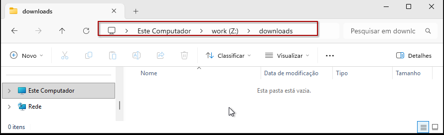

**Passo 3 — de volta ao hospedeiro**  
Monte o conteúdo real de `~/Downloads` **em cima** dessa pasta vazia:

```bash
sudo mount --bind /home/gsantana/Downloads /home/gsantana/work/downloads
```

Depois disso, `~/work/downloads` mostra os mesmos arquivos que `~/Downloads`.

**Passo 4 — na VM de novo**  
Atualize `Z:\downloads` (F5) ou abra a pasta outra vez: os arquivos devem aparecer.

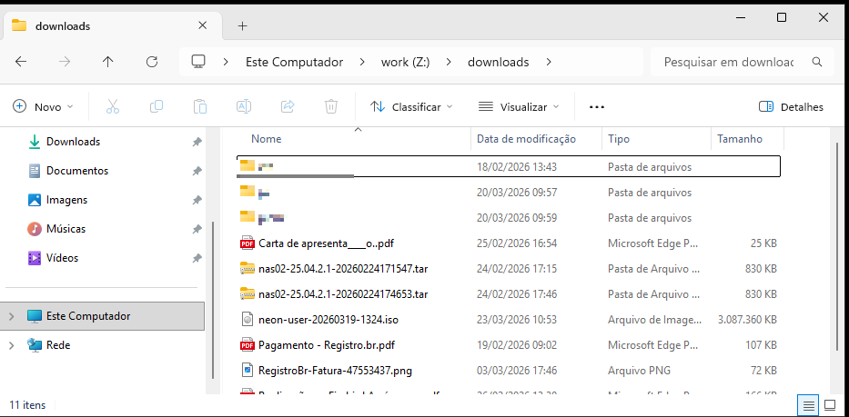

---

**Tornar o bind permanente (sobrevive ao reinício do Linux)**

1. **Por quê?** O comando `mount --bind` manual some se você reiniciar o **hospedeiro**. Para recriar a montagem automaticamente, use o arquivo **`/etc/fstab`** (lista de montagens do sistema).
2. **Edite o fstab** (use o editor que preferir, por exemplo `sudo nano /etc/fstab` ou `sudo editor /etc/fstab`):
```bash
sudo editor /etc/fstab
```
3. **Adicione uma linha** no final (ajuste usuário/caminhos se não for `gsantana`):
```text
# bind mounts importantes:
/home/gsantana/Downloads  /home/gsantana/work/downloads  none  bind,defaults  0  0
```
4. **Salve** e saia do editor.

**Testar sem reiniciar o hospedeiro**

- **No Windows (VM):** feche o Explorer e qualquer programa que use `Z:\downloads\...`. Se ainda travar, **desligue a VM** — o Windows às vezes mantém o diretório aberto e o `umount` no Linux falha.
- **No hospedeiro:** com `~/work/downloads` livre para desmontar, rode:
```bash
sudo systemctl daemon-reload   # recarrega unidades do systemd (útil após mudar fstab)
sudo umount /home/gsantana/work/downloads
sudo mount -a                    # monta tudo o que está no /etc/fstab
```
- Se **não** aparecer erro, o `fstab` provavelmente está certo. Confira no hospedeiro:
```bash
ls -lh ~/work/downloads
```
Os arquivos devem ser os mesmos de `~/Downloads`.

**Outras pastas:** repita o mesmo padrão — pasta vazia dentro de `~/work`, `mount --bind` da origem real para essa pasta, linha correspondente no `fstab` — até tudo o que precisar estiver sob **`/home/gsantana/work`**.

## Permissões: hospedeiro Linux × convidado Windows

**Grupos do login (ex.: `gsantana`):** para usar **virt-manager** / **virsh** sem ser root, o usuário deve estar no grupo **`libvirt`**. Em Debian (e na maioria das instalações com KVM), inclua também o grupo **`kvm`**, que libera acesso a **`/dev/kvm`** (aceleração). Não confunda com **`libvirt-qemu`**: esse é um **usuário de sistema** sob o qual o QEMU costuma rodar; **não** é o grupo em que se coloca a conta pessoal.

```bash
sudo adduser gsantana libvirt
sudo adduser gsantana kvm
newgrp libvirt
newgrp kvm
```
Arquivos criados a partir do Windows costumam aparecer no Linux com dono **`libvirt-qemu`**, não como **`gsantana`**. A **melhor prática** para compartilhar **`~/work`** é ACL para os **dois usuários** (`gsantana` **e** `libvirt-qemu`): você edita no hospedeiro como pessoa física; a VM não perde acesso quando o dono do inode for **`libvirt-qemu`**. As regras **default** (`-d`) cobrem **novos** arquivos e subpastas.

**Uma vez** (preferencialmente com a VM desligada ou sem uso intenso da pasta), alinhe dono e ACL:

```bash
sudo chown -R gsantana:gsantana ~/work
sudo setfacl -R  -m u:gsantana:rwx -m u:libvirt-qemu:rwx ~/work
sudo setfacl -R -d -m u:gsantana:rwx -m u:libvirt-qemu:rwx ~/work
```

Conferência rápida: `getfacl ~/work | head -25`

Documentação do libvirt sobre Virtio-FS: [Sharing files with Virtiofs](https://libvirt.org/kbase/virtiofs.html).

## SEGURANÇA

**Objetivo:** a VM enxergar só o que precisa; o hospedeiro não expor pastas sensíveis à toa.

| Princípio | Em prática |
|-----------|------------|
| **Menos é mais** | Crie um pool no `$HOME` se precisar, mas **não** exporte o `$HOME` inteiro. Uma VM comprometida ou um app bisbilhotando teria escopo enorme. |
| **Só o necessário** | Use como `Source Path` apenas pastas que essa VM realmente usa. Reduz risco e também limita **telemetria** de programas que, no fundo, se comportam como **spyware** no seu sistema. |
| **Padrão “pasta work”** | Uma pasta estilo **`work`**, com *bind mounts* só do que essa VM precisa, costuma ser o melhor equilíbrio entre praticidade e controle. |

## Dicas do YouTube

Este vídeo mostra o uso do **Virtio-FS** no Proxmox, reforça o ganho de desempenho e compara com métodos mais lentos, como WebDAV:

[COMPARTILHANDO ARQUIVOS ENTRE VMs NO PROXMOX? VEJA O PODER DO VIRTIO-FS\!](https://www.youtube.com/watch?v=1kGtxAVFIqc)  

---

[Voltar à página de virtualização nativa com QEMU/KVM — VM Windows](debian_qemu_kvm_windows.md)   


